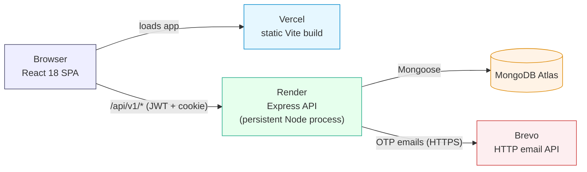
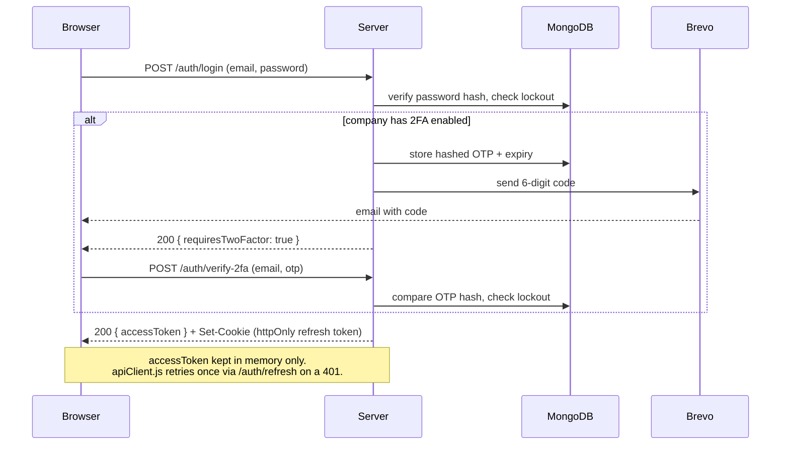

# Smaatech HRMS — People Operations (React + Express + MongoDB)

Production HRMS dashboard. Two workspaces: **`client/`** (React + Vite frontend) and **`server/`** (Express + MongoDB backend with real JWT auth and server-side face verification). The root `package.json` just orchestrates both.

---

## 🔑 Demo login accounts (local dev only)

`npm run seed:server` creates 4 demo accounts (HR Director, HR Manager, Finance Lead, Employee) so you have something to log in with on a fresh local database. Passwords are **not** in the source code — they're read from your `server/.env` file (`SEED_ADMIN_PASS`, `SEED_HR_PASS`, `SEED_FINANCE_PASS`, `SEED_EMPLOYEE_PASS`). Default suggestions are in `server/.env.example`.

> **These are dev-only placeholder credentials, not a real login system.** Don't rely on them past initial setup: create your own account (below) and deactivate or delete the seed accounts from **Settings → Users & role access** once you have one. Re-running the seed script also **wipes and recreates** the demo employee roster — don't run it against a database with real data you want to keep.

### Creating a real login

1. Sign in once with the seeded HR Director demo account (just to get in the door).
2. Go to **Settings → Users & role access → Add user**. Enter your own name, a real email you control, a strong password, and the role you want (HR Director for full access).
3. Sign out and sign back in with that new account to confirm it works.
4. Go back to **Settings → Users & role access**, open each of the 4 seed accounts, and either toggle them **inactive** or delete them.

---

## 🚀 Local dev

```bash
npm install                  # root orchestrator deps (concurrently)
npm --prefix client install  # frontend deps
npm --prefix server install  # backend deps

cp server/.env.example server/.env   # fill in MONGODB_URI, JWT secrets, SMTP creds, seed passwords
npm run seed:server                  # first time only — creates the demo accounts above

npm run dev                  # client (http://localhost:5173) + server (http://localhost:4000)
```

Requires **Node 18+**. The client dev server proxies `/api/*` to `localhost:4000` automatically (`client/vite.config.js`) — no extra config needed locally.

---

## 🏗️ Architecture

```
client/                     # React 18 + Vite — talks to the server over /api/v1
├── src/lib/apiClient.js    # fetch wrapper: JWT access token in memory, httpOnly refresh cookie
├── src/data/store.js       # REST calls for server-backed resources
├── src/context/HRMSContext.jsx   # single app-wide data/actions store (no Redux/Query)
└── src/pages/, src/components/

server/                     # Express + Mongoose, MongoDB Atlas
├── src/app.js              # pure Express app: middleware + all /api/v1/* route mounts (no side effects — importable by tests)
├── src/index.js            # thin entrypoint: starts app.js listening, connects the DB, boots background jobs
├── src/routes/             # auth, employees, attendance, leave, payroll, recruitment, ...
├── src/middleware/auth.js  # requireAuth / requireRole / companyFilter — see Multi-tenancy below
├── src/models/             # Mongoose schemas
├── src/lib/faceEngine.js   # loads face-api.js models from public/models at boot
└── src/lib/mailer.js       # Brevo HTTP API — real OTP email delivery

public/models/               # face-api.js model weights (shared by client UX + server verification)
```

Employees, attendance, leave, payroll, recruitment, reviews, expenses, assets, jobs, holidays, celebrations, settings, documents, resignations, and corrections all live in MongoDB via the server's REST API — nothing application-level persists in `localStorage`.

### System topology



The server needs a persistent process (it loads face-api.js/TensorFlow models at startup and holds refresh-token sessions), so it runs on Render rather than Vercel's serverless functions — see **Deploying** below. Client and server deploy and scale independently; a push to `main` triggers both, but they are not atomic.

### Auth & login 2FA flow



**5** wrong password or OTP attempts lock the account for 15 minutes (shared `failedLoginAttempts`/`lockedUntil` fields); `/forgot-password` and `/reset-password` are rate-limited the same way.

### Multi-tenancy

Every tenant-scoped collection carries a `company` field. `server/src/middleware/auth.js`'s `companyFilter(req)` returns `{ company: req.auth.company }` for every request — including `HR Director`, which is a **per-company** admin role (it bypasses permission checks within its own tenant via `requireRole()`, but never sees another company's data). Today's deployment only has one company (`Smaatech`); the scoping exists so onboarding a second one doesn't silently leak data across tenants.

### Security layers

- **AuthN**: JWT access token (short-lived, memory-only) + httpOnly rotating refresh cookie; bcrypt-hashed passwords.
- **AuthZ**: `requireRole()` checks a DB-backed `Role.allowedActions` list per route, not just the JWT's role string.
- **2FA**: real email-OTP, per-company toggle (see flow above).
- **Rate limiting**: a strict limiter on `/login`, `/face-login`, `/verify-2fa`, `/forgot-password`, `/reset-password`; a looser one across all of `/api/*`.
- **CSP**: enforced on the deployed client (`client/vercel.json`) — `default-src 'self'` plus a narrow allowlist for fonts, the API origin, and face-api.js's WASM.
- **Input handling**: `express-mongo-sanitize` against NoSQL injection, `helmet` default headers, Joi request validation.
- **File uploads**: mimetype allowlists, an uploads-root containment check on every save/read/delete, and whitelisted (never client-supplied) fields on the records that reference them.

---

## ☁️ Deploying (Vercel + Render)

The server needs a persistent Node process (it loads face-api.js/TensorFlow models at startup and keeps refresh-token sessions), so it can't run on Vercel's serverless functions. Split deploy:

- **Server → [Render](https://render.com)** (free tier, persistent web service)
- **Client → [Vercel](https://vercel.com)** (static Vite build)
- **Database → MongoDB Atlas** (already set up — reuse the same `MONGODB_URI` you use locally so the demo accounts above carry over)

### 1. Deploy the server to Render
1. In the Render dashboard: **New → Blueprint**, connect the `sepl65473-lang/Smaatech-HRMS` GitHub repo. Render reads `render.yaml` at the repo root and proposes a `smaatech-hrms-api` web service.
2. Fill in the prompted environment variables (values from your local `server/.env`): `MONGODB_URI`, `JWT_ACCESS_SECRET`, `JWT_REFRESH_SECRET`, `BREVO_API_KEY`, `SMTP_USER`. Leave `CLIENT_ORIGIN` for step 3.
3. Deploy. Note the resulting URL, e.g. `https://smaatech-hrms-api.onrender.com`.
4. **MongoDB Atlas → Network Access → Add IP Address → Allow Access from Anywhere (`0.0.0.0/0`)** — Render's free tier has no static IP, so Atlas needs to accept connections from any IP.

### 2. Deploy the client to Vercel
1. In the Vercel dashboard: **Add New → Project**, import the same GitHub repo.
2. Set **Root Directory** to `client`. Vercel auto-detects Vite; `client/vercel.json` adds the SPA fallback rewrite (needed because the app uses client-side routing) — no extra config needed.
3. Add an environment variable: `VITE_API_BASE_URL` = `https://smaatech-hrms-api.onrender.com/api/v1` (your Render URL from step 1, with `/api/v1` appended).
4. Deploy. Note the resulting URL, e.g. `https://smaatech-hrms.vercel.app`.

### 3. Connect them
1. Back in Render, set the server's `CLIENT_ORIGIN` env var to your Vercel URL from step 2 (e.g. `https://smaatech-hrms.vercel.app`), then let it redeploy/restart.
2. Open the Vercel URL and log in with a demo account above.

> **Render free tier spins down after ~15 min idle.** The first request after a while can take 30–60 seconds to wake back up — if login seems to hang right after opening the site cold, that's the server waking up, not a bug. Subsequent requests are fast.

---

## ✨ Features

| Module | CRUD operations / Workflows |
|---|---|
| **Employees** | Add / Edit / Delete + search + department filter + skills & documents (full validation) |
| **Attendance** | Check-in / Check-out with geofence + face verification, late detection, and **Attendance Corrections** request & approval workflow |
| **Leave** | New request, Approve / Decline, delete history, status filters |
| **Payroll** | Process payroll, mark as paid, auto gross/deduction/net calc |
| **Celebrations** | Send wishes, birthday/anniversary detection from real employee data |
| **Recruitment** | Kanban — candidate add/delete, stage move (Applied → Hired) |
| **Performance** | Reviews + ratings, auto-sorted leaderboard |
| **Expenses / Assets / Jobs** | Full CRUD, status workflows |
| **Documents** | Document library + **Document Expiry Alerts** (email warnings) & secure stream downloads |
| **Exit & Clearance** | **Resignation filings**, multi-department clearances (IT, Finance, HR, Admin), and Full & Final settlement calculations with automated employee exit deactivation |
| **Settings** | Org config, users & role access, geofence/shift config, notification templates (stored on server MongoDB) |
| **Dashboard** | Live stats from real data, attendance chart, quick actions |
| **Auth & security** | Real email-OTP login 2FA (per-company toggle), self-service password change, active-session management, account lockout after repeated failed attempts, rate-limited password reset |

---

## 🛠️ Tech stack

- **Client**: React 18, Vite 5, react-router-dom v6, Context API
- **Server**: Express 4, Mongoose 8 (MongoDB Atlas), JWT auth (jsonwebtoken + bcryptjs), face-api.js + TensorFlow.js (WASM) for server-side face verification, Brevo HTTP API (OTP emails — not SMTP, which Render's free tier blocks outbound)
