# Smaatech HRMS — People Operations Platform

A multi-module HRMS built as two independent workspaces: **`client/`** (React 18 + Vite SPA) and **`server/`** (Express 4 + Mongoose 8 REST API on MongoDB). The root `package.json` only orchestrates both; a third, shared `public/` directory holds the face-recognition model weights that *both* the browser and the Node server read.

Everything documented below was verified against the source in this repository. Where a feature is scaffolding, a stub, or a heuristic rather than a finished capability, it is marked as such — see [Implementation Status](#-implementation-status) and [Known Limitations](#-known-limitations).

---

## 📑 Table of contents

- [Overview & Key Features](#-overview--key-features)
- [Tech Stack](#-tech-stack)
- [System Architecture](#-system-architecture)
- [Frontend Architecture](#-frontend-architecture)
- [Backend Architecture](#-backend-architecture)
- [Database Architecture](#-database-architecture)
- [End-to-End System Flow](#-end-to-end-system-flow)
- [Authentication & Authorization](#-authentication--authorization)
- [Employee Lifecycle](#-employee-lifecycle)
- [Attendance Workflow](#-attendance-workflow)
- [Leave Management Workflow](#-leave-management-workflow)
- [Dashboard Data Flow](#-dashboard-data-flow)
- [API Architecture & Reference](#-api-architecture--reference)
- [External Integrations](#-external-integrations)
- [Email & Notification Workflow](#-email--notification-workflow)
- [Face Authentication Workflow](#-face-authentication-workflow)
- [Device & Location Tracking](#-device--location-tracking)
- [File & Document Handling](#-file--document-handling)
- [Security Architecture](#-security-architecture)
- [Background Jobs & Scheduling](#-background-jobs--scheduling)
- [CI/CD Pipeline](#-cicd-pipeline)
- [Production Deployment Architecture](#-production-deployment-architecture)
- [Environment Configuration](#-environment-configuration)
- [Project Structure](#-project-structure)
- [Testing](#-testing)
- [Logging, Monitoring & Health Checks](#-logging-monitoring--health-checks)
- [Error Handling](#-error-handling)
- [Implementation Status](#-implementation-status)
- [Known Limitations](#-known-limitations)
- [Future Improvements](#-future-improvements)
- [Local Development Setup](#-local-development-setup)
- [Production Deployment](#-production-deployment)
- [Troubleshooting](#-troubleshooting)
- [Contributing & License](#-contributing--license)

---

## 🎯 Overview & Key Features

Smaatech HRMS is a multi-tenant-capable People Operations system (one company, `Smaatech`, is configured in practice). Every tenant-scoped collection carries a `company` field and every query is scoped through `companyFilter(req)`.

| Module | What it actually does in this codebase |
|---|---|
| **Authentication** | Email + password login, optional per-company email-OTP 2FA, face sign-in, JWT access tokens (15 min) + rotating httpOnly refresh cookies (30 days), account lockout after 5 failed attempts, self-service password change, OTP password reset, active-session listing/revocation |
| **Authorization** | 4 built-in roles (`HR Director`, `HR Manager`, `Finance Lead`, `Employee`) with a DB-backed `Role.allowedActions` list checked per route, plus a client-side route access map |
| **Employees** | Full CRUD, bulk update, soft-delete (`?soft=true`), 8-stage onboarding lifecycle, manager hierarchy, statutory identity fields (PAN/UAN/ESI/tax regime), education/experience/family sub-documents, CSV import |
| **Attendance** | Four independent punch channels — self-service (face + geofence), QR code, HR manual override, and biometric-device HTTP ingest — plus shift/lateness/half-day/early-exit derivation, a nightly row-creation cron, and a correction request/approval workflow |
| **Leave** | Multi-stage approval workflow (snapshotted per request), overlap validation, working-day calculation excluding weekends + holidays, half-day support, self-service withdrawal, automatic attendance marking on final approval |
| **Payroll** | Cycle-based payroll rows, earnings/deductions components with statutory categories, LOP auto-computed from real attendance, payslip HTML export, Tally-compatible XML journal export |
| **Exit & Clearance** | Resignation filing, 4-department clearance checklist (IT/Finance/HR/Admin), Full & Final settlement calculation, and an idempotent FnF payout that terminates the employee and disables their login in one transaction |
| **Documents** | Metadata + file upload behind a MIME allowlist, role/visibility-scoped listing, authenticated streaming download, and a nightly 30-day expiry-reminder job |
| **Expenses / Assets / Jobs / Recruitment / Reviews** | CRUD with status workflows; expenses use the same multi-stage approval engine as leave |
| **Celebrations** | Birthdays and work anniversaries computed live from real `dob`/`joinDate` (never stored), with idempotent "wished" acknowledgements |
| **Notifications** | In-app notification collection + real transactional email; SMS/WhatsApp/Push channels are console-log scaffolding only |
| **Audit logging** | Every mutating route writes an `AuditLog` with actor, IP, user agent, and a full before/after field diff |
| **Observability** | `/health` liveness + DB readiness, `/metrics` JSON **and** Prometheus text exposition, event-loop-lag estimator |

---

## 🧰 Tech Stack

### Frontend (`client/`)

| Concern | Choice |
|---|---|
| Framework | React 18.3 |
| Build tool | Vite 5.4 (`publicDir` repointed to the repo-root `public/`) |
| Routing | `react-router-dom` 6.26, `BrowserRouter`, every page lazy-loaded via `React.lazy` |
| State | A single `HRMSContext` provider (Context API) — no Redux, no React Query |
| HTTP | `axios` 1.18 instance with request/response interceptors |
| UI | Hand-written CSS (`src/index.css`), `lucide-react` icons, `react-toastify` toasts |
| Face recognition | `face-api.js` 0.22 (browser; UX-only pre-match + blink liveness) |
| Exports | `jspdf` + `jspdf-autotable` (PDF), `xlsx` (Excel, write-only), hand-rolled CSV and Tally XML |
| QR | `qrcode.react` (display) + `jsqr` (scan) |
| PWA | `public/manifest.json` + hand-rolled `public/sw.js`, registered in production builds only |
| Testing | Vitest 4 + Testing Library + jsdom |

### Backend (`server/`)

| Concern | Choice |
|---|---|
| Runtime | Node 20 (ESM, `"type": "module"`) |
| Framework | Express 4.19 + `express-async-errors` |
| Data layer | Mongoose 8.5 on MongoDB |
| Auth | `jsonwebtoken` (access tokens) + opaque SHA-256-hashed refresh tokens, `bcryptjs` password hashing |
| Validation | Joi 18 via a shared `validate()` middleware |
| Security | `helmet`, `express-mongo-sanitize`, `express-rate-limit`, `cors`, `cookie-parser` |
| Face recognition | `@vladmandic/face-api` on `@tensorflow/tfjs` + `@tensorflow/tfjs-backend-wasm`, offloaded to a `worker_threads` worker |
| Uploads | `multer` (memory storage) behind MIME allowlists and an uploads-root containment check |
| Scheduling | `node-cron` |
| Logging | `winston` + `winston-daily-rotate-file` |
| API docs | `swagger-jsdoc` + `swagger-ui-express` at `/api-docs` |
| Testing | Vitest 4 + `supertest` + `mongodb-memory-server` |

---

## 🏗 System Architecture

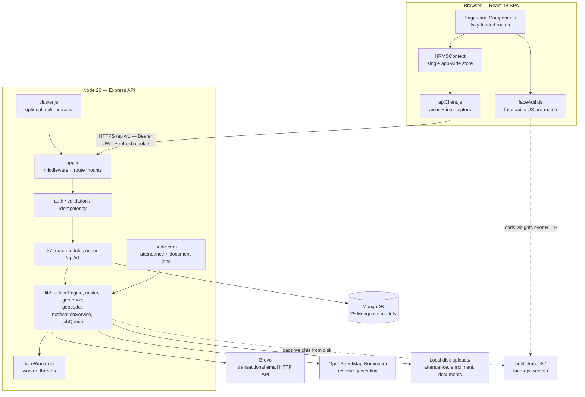

**Key architectural decisions verified in code**

- `app.js` builds a **pure Express app** — no `listen()`, no DB connection, no cron. `index.js` is the only side-effecting entry point. This is what lets the 18 server test files import a fully wired app and drive it with `supertest`.
- The face model weights in `public/` are shared: `client/vite.config.js` sets `publicDir: '../public'`, and `server/src/lib/faceEngine.js` resolves `../../../public/models` off disk.
- The server needs a **persistent process** — it loads TensorFlow WASM models at boot and keeps in-memory QR tokens, an idempotency store, and a settings cache.

---

## 🖥 Frontend Architecture

```
client/src/
├── main.jsx                  # ReactDOM root → ErrorBoundary → BrowserRouter → HRMSProvider → App
├── App.jsx                   # Route table; every page is React.lazy(); <Guard> wraps each route
├── context/HRMSContext.jsx   # THE state container — all entities, all actions, auth bootstrap
├── lib/
│   ├── apiClient.js          # axios instance, Bearer injection, 401 → /auth/refresh → single retry
│   ├── permissions.js        # ROLE_ACCESS route map, canDo() action map
│   ├── faceAuth.js           # lazy face-api.js loader, descriptor extraction, blink liveness
│   ├── deviceId.js           # persistent per-browser UUID in localStorage
│   ├── shifts.js             # mirrors server shift logic (the server's answer is authoritative)
│   ├── exportCsv / exportPdf / exportXlsx / payslip / tally
│   └── helpers, csv, attendanceStatus, fileStore
├── data/store.js             # Thin REST wrappers per resource (restResource factory)
├── pages/                    # 21 route pages
└── components/               # 24 shared components and modals
```

**State model.** There is exactly one store: `HRMSProvider`. It holds every collection (`employees`, `leaves`, `attendance`, `payroll`, `documents`, `resignations`, …), the auth user, settings, notifications and the audit log, and exposes the action callbacks the pages use. `loadAll()` in `data/store.js` fetches 20 collections in a single `Promise.all` after authentication.

**Auth state.** The access token lives **in a module-level variable in `apiClient.js`** — never `localStorage`, never a JS-readable cookie. On page load `HRMSProvider` calls `authApi.bootstrap()`, which POSTs `/auth/refresh` using the httpOnly cookie; if that succeeds the app rehydrates silently, otherwise the login screen renders.

**API layer.** A response interceptor catches `401`, calls `/auth/refresh` once (de-duplicated through a shared `refreshingPromise`), and replays the original request. Auth routes and `skipAuth` requests are excluded so a failed login never triggers a refresh loop. All errors are normalised into `ApiError { status, code, message }`. For `FormData` bodies the interceptor deletes the default `Content-Type` header so the browser can supply its own multipart boundary.

**Routing & guards.** `<Guard path="…">` consults `canAccess(role, path)` from the client `ROLE_ACCESS` map and renders an "Access restricted" placeholder instead of the page. `EmployeeProfileGuard` additionally lets an employee open their own profile without directory access. **These are UX guards only — every real check is re-done server-side.**

**Bundle strategy.** Manual Rollup chunks split `jspdf`, `xlsx`, `face-api.js`, `lucide-react` and React into separate vendor bundles; `face-api.js` is additionally `import()`-ed lazily so it is only fetched when face enrollment or face login is used.

---

## 🔩 Backend Architecture

```
server/src/
├── index.js                  # dotenv → setupCluster → app.listen → connectDB, initFaceEngine, 2 cron schedulers
├── cluster.js                # opt-in multi-process fork (ENABLE_CLUSTER / WEB_CONCURRENCY)
├── app.js                    # helmet → sanitize → compression → CORS → rate limits → json → cookies → /api-docs → 27 routers → error handler
├── db.js                     # mongoose.connect with an 8s then 20s retry
├── seed.js                   # destructive demo seed (wipes Employee/User/Attendance/Settings/Role)
├── middleware/
│   ├── auth.js               # requireAuth, requireRole, companyFilter
│   ├── validation.js         # Joi validate() with stripUnknown
│   └── idempotency.js        # in-memory Idempotency-Key replay cache, 24h TTL
├── models/                   # 25 Mongoose schemas
├── routes/                   # 27 routers
├── validations/              # 5 Joi schema modules
└── lib/                      # 26 service and utility modules
```

### Middleware order in `app.js`

1. `helmet({ contentSecurityPolicy: false })` — CSP is disabled on the API so Swagger UI works; the browser-facing CSP is set by the static host instead.
2. `express-mongo-sanitize` — strips `$`/`.` operators from request payloads (NoSQL injection).
3. `compression`.
4. **CORS — deliberately registered before the rate limiters.** `express-rate-limit` ends the response itself, so anything mounted after it never runs for a throttled request; without CORS headers the browser reports a bare "Network Error" instead of "too many requests".
5. Rate limiters (see [Security](#-security-architecture)).
6. `express.json()`, `cookieParser()`.
7. `/api-docs` Swagger UI.
8. The 25 `/api/v1/*` routers.
9. A terminal error handler that logs via winston and returns a generic `INTERNAL_ERROR`.

### Authorization: how `requireRole()` actually resolves

`requireRole()` is not a plain role-string check. Its order is:

1. `HR Director` → always allowed (per-company superuser).
2. Load the caller's `Role` document; a missing role document → `403`.
3. Map `req.baseUrl` through `ROUTE_ACTION_MAP` (e.g. `/api/v1/payroll` → `managePayroll`) and allow if `role.allowedActions` contains it.
4. Allow if the caller's role name is one of the literal arguments passed to `requireRole(...)`.
5. Allow if any argument is an action name present in `role.allowedActions`.
6. Otherwise `403`.

### Multi-tenancy

`companyFilter(req)` returns `{ company: req.auth.company }` for **every** caller, HR Director included. The source comment records the reasoning: HR Director is a *per-company* superuser, not a cross-tenant platform admin, so it must never receive an unscoped `{}` filter. A `tenantPlugin` Mongoose plugin exists for query-level `.option({ tenant })` scoping but is **not currently attached to any schema**.

### Concurrency & performance features

| Feature | File | Behaviour |
|---|---|---|
| Multi-process cluster | `cluster.js` | Off by default. `ENABLE_CLUSTER=true` or `WEB_CONCURRENCY=<n>` forks workers; dead workers are respawned |
| Face worker thread | `lib/faceWorker.js` | CPU-bound WASM descriptor extraction runs off the event loop; falls back to in-process on worker error/exit, bypassed when `DISABLE_FACE_WORKER=true` or `NODE_ENV=test` |
| Non-blocking batch queue | `lib/jobQueue.js` | `processInNonBlockingBatches()` chunks large jobs and awaits a 10 ms `setTimeout` between chunks so HTTP requests keep being served |
| In-process cache | `lib/cacheStore.js` | Generic TTL `Map`. Two callers use it: `getSettingsDoc()` caches per-company settings for **5 minutes**, invalidated on any settings write; `GET /master-data/master-values` caches per-company values for **10 minutes**, invalidated on any master-value write |
| Transactions | `lib/transactionHelper.js` | `runInTransaction()` uses a Mongoose session where the deployment supports it and degrades gracefully on standalone MongoDB |
| Idempotency | `middleware/idempotency.js` | `Idempotency-Key` / `X-Idempotency-Key` replay protection, applied to `POST /resignations/:id/fnf/pay` |
| Response caps | route handlers | Un-paginated list endpoints are hard-capped at 100 rows; paginated ones cap `limit` at 100 (200 for attendance) |

---

## 🗄 Database Architecture

**Engine:** MongoDB. **Access layer:** Mongoose 8 with `strictQuery: true`. **Connection:** `server/src/db.js` — a single `connectDB()` with an 8-second then 20-second `serverSelectionTimeoutMS` retry, called from `index.js` and again defensively at the top of each cron job.

**Conventions applied across the 25 models:**

- Primary key is Mongo's `_id` (`ObjectId`), except `Settings`, whose `_id` **is the company name** (string).
- Foreign keys are `ObjectId` with a Mongoose `ref` (no DB-level referential integrity — MongoDB does not enforce FKs).
- `timestamps: true` is set on 24 of the 25 models, giving them `createdAt` / `updatedAt`. **`Settings` is the one exception** — it has no `timestamps` option, so a settings document carries neither field.
- A `toJSON` transform exposes `id` as a string and deletes `_id` / `__v`. `User` additionally deletes `passwordHash`, both OTP hashes and their expiries, `failedLoginAttempts` and `lockedUntil` — so those never leave the server.
- Tenant-scoped models carry an indexed `company: String` field defaulting to `'Smaatech'`.

### Entity relationship diagram

```mermaid
erDiagram
    USER ||--o| EMPLOYEE : "employeeId — links a login to a person"
    USER ||--o{ REFRESHTOKEN : "userId — active sessions"
    USER ||--o| FACEDESCRIPTOR : "userId — one enrolled template"
    USER ||--o{ NOTIFICATION : "recipientId — null means broadcast"
    USER ||--o{ EMAILLOG : "userId — delivery audit"

    EMPLOYEE ||--o{ EMPLOYEE : "managerId — reporting line"
    EMPLOYEE ||--o{ ATTENDANCE : "empId — one row per day"
    EMPLOYEE ||--o{ LEAVE : "empId"
    EMPLOYEE ||--o{ PAYROLL : "empId"
    EMPLOYEE ||--o{ EXPENSE : "empId"
    EMPLOYEE ||--o{ REVIEW : "empId"
    EMPLOYEE ||--o{ DOCUMENT : "ownerId"
    EMPLOYEE ||--o{ RESIGNATION : "employeeId"
    EMPLOYEE ||--o{ ATTENDANCECORRECTION : "employeeId"
    EMPLOYEE ||--o{ ASSET : "assignedToEmpId"
    EMPLOYEE ||--o{ WISH : "employeeId"
    EMPLOYEE ||--o{ DEVICEUSERMAPPING : "empId"

    MASTERCATEGORY ||--o{ MASTERVALUE : "categoryId"

    USER {
        ObjectId _id PK
        string name
        string email UK "unique, lowercased"
        string passwordHash "bcrypt, never serialised"
        string role "HR Director|HR Manager|Finance Lead|Employee"
        ObjectId employeeId FK
        boolean active
        string status "Pending|Active|Inactive|Suspended"
        boolean mustChangePassword
        string company "indexed"
        string otpHash "password reset, bcrypt"
        string loginOtpHash "2FA, separate from reset"
        number failedLoginAttempts
        date lockedUntil
        date lastLoginAt
        string lastLoginIp
    }

    EMPLOYEE {
        ObjectId _id PK
        string name
        string email "unique per company when non-empty"
        string dept
        string status "active|remote|on-leave|terminated|exited"
        string onboardingStatus "8-stage enum"
        string joinDate
        string dob
        number salary
        ObjectId managerId FK
        string pan
        string uan
        string esiNumber
        string taxRegime "old|new"
        array skills
        array education
        array experience
        array family
        string company "indexed"
    }

    ATTENDANCE {
        ObjectId _id PK
        ObjectId empId FK
        string date "YYYY-MM-DD"
        string checkIn "HH:MM"
        string checkOut "HH:MM"
        string status "present|late|absent|leave|early-exit|half-day|holiday"
        mixed checkInVerification "server-derived face and gps proof"
        number checkInAccuracy
        string checkInAddress "reverse geocoded"
        string checkInDeviceId
        mixed checkInDevice "parsed from User-Agent"
        string checkInIp
        string checkInPhotoRef
        number checkInFaceConfidence
        array anomalyFlags
        string company "indexed"
    }

    LEAVE {
        ObjectId _id PK
        ObjectId empId FK
        string type "sick|casual|earned|unpaid|maternity|paternity"
        string start
        string end
        string status "pending|approved|declined|withdrawn"
        boolean isHalfDay
        number workingDays
        array approvalStages "snapshot at creation"
        number currentStage
        array approvals
        string company "indexed"
    }

    PAYROLL {
        ObjectId _id PK
        ObjectId empId FK
        string cycle "YYYY-MM"
        number gross
        number deductions
        number net
        number lopDays
        number lopAmount
        object components "earnings and PF/ESI/PT/TDS deductions"
        string status "ready|processing|paid"
        string company "indexed"
    }

    RESIGNATION {
        ObjectId _id PK
        ObjectId employeeId FK
        string resignationDate
        string requestedLastWorkingDay
        string status "Submitted|Approved|Rejected"
        array clearances "IT, Finance, HR, Admin"
        object fnfSettlement "Draft|Processed|Paid"
        string company "indexed"
    }

    SETTINGS {
        string _id PK "company name, not an ObjectId"
        boolean gpsCheckInEnabled
        number geofenceLat
        number geofenceLng
        number geofenceRadius
        mixed shifts
        mixed roster
        boolean twoFactor
        string biometricDeviceApiKey "never returned by GET /settings"
        mixed notificationTemplates
        mixed notifyChannels
        mixed approvalWorkflows
    }

    ROLE {
        ObjectId _id PK
        string name UK
        array allowedPaths
        array allowedActions
    }

    FACEDESCRIPTOR {
        ObjectId _id PK
        ObjectId userId FK "unique"
        array descriptor "128 floats, computed server-side"
        string photoRef
        date enrolledAt
    }

    AUDITLOG {
        ObjectId _id PK
        object actor "id, name, role"
        string action
        string subject
        mixed before
        mixed after
        mixed diff
        string ip
        string userAgent
        string company "indexed"
    }
```

Not shown above because they carry no foreign keys: **`HOLIDAY`**, **`JOB`**, **`CANDIDATE`** (all company-scoped standalone collections).

### Indexes

| Collection | Index | Purpose |
|---|---|---|
| `attendances` | `{ empId, date }` **unique** | One row per employee per day — makes the nightly job safely re-runnable |
| `attendances` | `{ company, date, status }`, `{ company, date: -1 }` | Dashboard/summary aggregation |
| `employees` | `{ company, email }` **unique, partial** (`email` non-empty) | One employee per email per company, but blank emails don't collide |
| `employees` | `{ company, dept, status }` | Directory filtering |
| `leaves` | `{ company, status, start }`, `{ company, createdAt: -1 }` | Approval queue + history |
| `auditlogs`, `documents`, `expenses`, `payrolls`, `resignations` | `{ company, createdAt: -1 }` | Reverse-chronological listing |
| `notifications` | `{ recipientId, read, createdAt: -1 }` | Unread badge |
| `deviceusermappings` | `{ company, deviceId, deviceUserId }` **unique** | One mapping per device user |
| `wishes` | `{ employeeId, type, year }` **unique** | Makes "send wish" naturally idempotent |
| `emaillogs` | `{ company, idempotencyKey }` partial | Duplicate welcome-email suppression |
| `users` | `email` **unique** | One login per email |
| `mastervalues` | `{ company, categoryId }` | Master-data lookup |
| `refreshtokens` | `tokenHash` **unique** | Session lookup by hashed token |
| `facedescriptors` | `userId` **unique** | One enrolled template per account |
| `roles`, `mastercategories` | `name` / `code` **unique** | System role and master-category names |

---

## 🔄 End-to-End System Flow

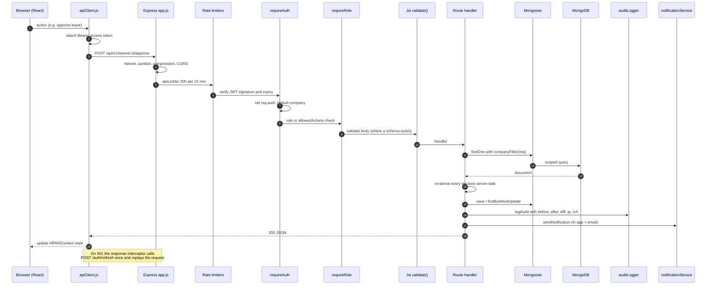

---

## 🔐 Authentication & Authorization

### Token model

| Token | Type | Lifetime | Storage | Revocable |
|---|---|---|---|---|
| Access token | JWT (HS256, `JWT_ACCESS_SECRET`) | **15 minutes** | JS memory only (`apiClient.js` module variable) | No — short TTL is the mitigation |
| Refresh token | **Opaque** 48-byte random hex, SHA-256 hashed at rest | **30 days** | httpOnly cookie `sepl_refresh`, `path=/api/v1/auth` | Yes — delete/revoke the `RefreshToken` row |

Access-token claims: `sub`, `role`, `name`, `email`, `employeeId`, `company`.

Cookie flags: `httpOnly: true`; in production `secure: true` + `sameSite: 'none'` (required for the cross-site Vercel → Render fetch), `sameSite: 'lax'` in development.

> **Note:** `JWT_REFRESH_SECRET` is listed in `server/.env.example`, `render.yaml` and the `api/index.js` config check, but **no code path reads it** — refresh tokens are opaque random strings, not JWTs. It is kept because `api/index.js` fails fast if it is unset.

### Login flow

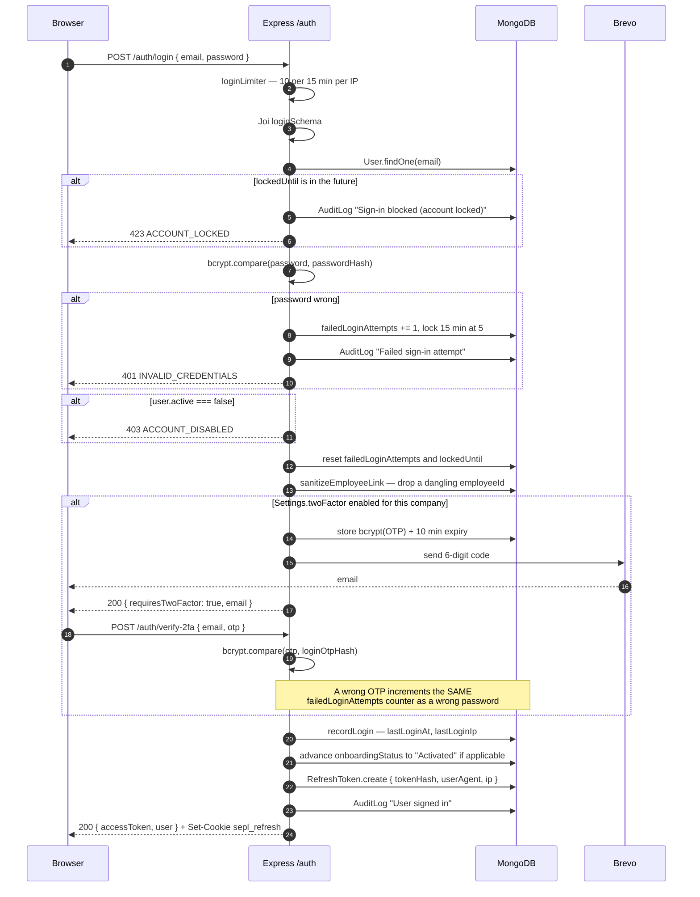

### Lockout policy

`LOCK_THRESHOLD = 5`, `LOCK_DURATION_MS = 15 minutes`. The same `failedLoginAttempts` / `lockedUntil` pair is incremented by a wrong **password**, a wrong **login 2FA code**, and a wrong **password-reset OTP** — closing the gap where an IP-rotating attacker could brute-force a 6-digit code past the IP rate limiter.

### Refresh rotation

`POST /auth/refresh` looks up the token by SHA-256 hash, rejects it if revoked or expired, **marks the old row revoked**, and issues a brand-new token — full rotation, not reuse. A disabled account clears the cookie and gets `403`.

### Session management

| Endpoint | Who |
|---|---|
| `GET /auth/sessions` | Self — lists live refresh tokens with user agent and IP, flagging the current one |
| `DELETE /auth/sessions/:id` | Self |
| `POST /auth/sessions/revoke-others` | Self |
| `GET /users/:id/sessions` | HR Director — another account's sessions |
| `DELETE /users/:id/sessions/:sessionId` | HR Director |

### Password policy

Minimum 8 characters, at least one letter and one digit (`lib/passwordPolicy.js`, enforced by both Joi schemas and `isStrongPassword()`). Hashing is `bcryptjs` with cost factor 10 everywhere.

### Role capability matrix

Route access is enforced server-side by `requireRole()`; the table below reflects `seed.js`'s `Role.allowedActions` plus the literal role arguments in the routers.

| Capability | HR Director | HR Manager | Finance Lead | Employee |
|---|:---:|:---:|:---:|:---:|
| Employees CRUD / bulk / verify onboarding | ✅ | ✅ | ❌ | own profile only |
| Attendance roster override, QR token issue | ✅ | ✅ | ❌ | ❌ |
| Self check-in / check-out | ✅ | ✅ | ✅ | ✅ |
| Leave approve / decline | ✅ | stage-dependent | stage-dependent | ❌ |
| Leave file / withdraw own | ✅ | ✅ | ✅ | ✅ |
| Payroll create / update / delete | ✅ | ✅ | ✅ | ❌ |
| Expenses approve / decline | ✅ | stage-dependent | stage-dependent | ❌ |
| FnF calculate / pay | ✅ | ❌ | ✅ | ❌ |
| Documents upload | ✅ | ✅ | ❌ | ❌ |
| Users & logins | ✅ | ❌ | ❌ | ❌ |
| Roles CRUD, master data | ✅ | ❌ | ❌ | ❌ |
| Audit log read | ✅ | ❌ | ❌ | ❌ |
| Settings update, device-key regenerate | ✅ | ✅ | ❌ | ❌ |

---

## 👤 Employee Lifecycle

`Employee.onboardingStatus` is an 8-value enum. Transitions are driven by real events, not manual selection:

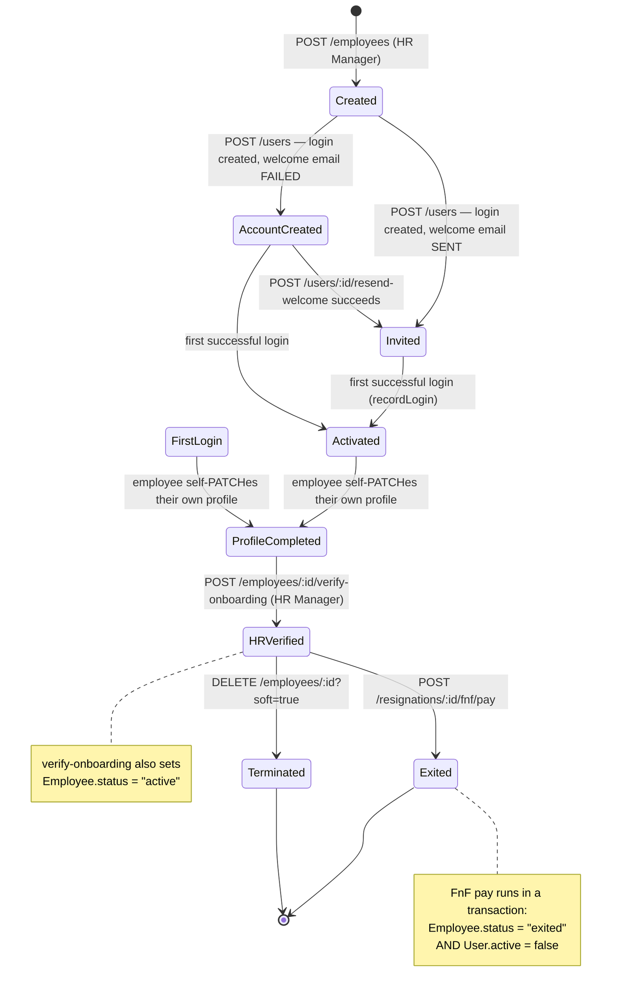

**Field-level protection.** On `PATCH /employees/:id`, a non-HR caller can only edit their own record, and `RESTRICTED_FIELDS` — `salary`, `role`, `dept`, `loc`, `status`, `managerId`, `joinDate`, `rating`, `employmentType`, `company`, `email`, `onboardingStatus` — are stripped from the body before the update. `POST /employees/bulk-update` inverts this: **only** those restricted fields are applied, and only for HR Manager.

**Denormalisation sync.** Changing an employee's `name` or `email` automatically patches the linked `User` login record in the same handler.

**Audit detail.** The employee PATCH handler builds a human-readable change summary for sensitive fields (salary, role, dept, status, onboarding) on top of the generic before/after diff.

---

## 🕐 Attendance Workflow

There are **four** distinct ways a punch reaches the `Attendance` collection, with different trust levels.

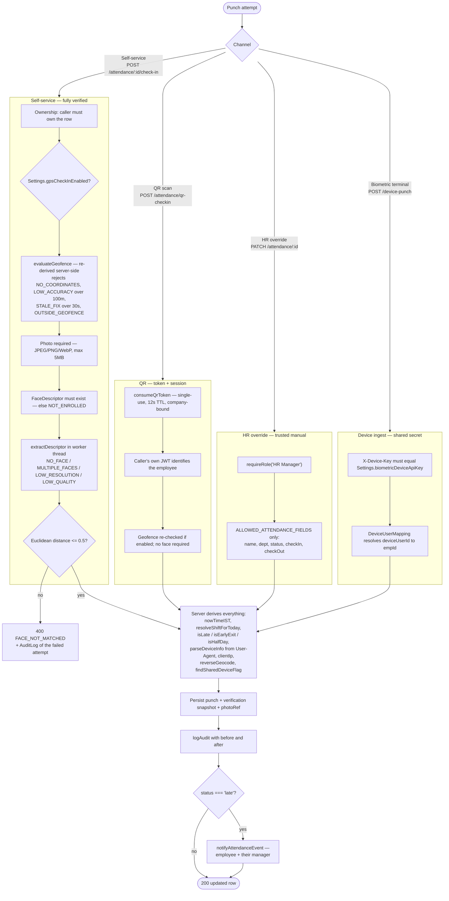

### Status derivation

| Status | Condition |
|---|---|
| `present` | Checked in within `shift.start + graceMins` |
| `late` | Checked in after the grace cutoff (`isLate`, overnight-shift aware) |
| `early-exit` | Checked out before `shift.end` |
| `half-day` | Worked less than half the scheduled shift duration |
| `absent` | Default for a row created by the nightly job with no check-in |
| `leave` | Employee is `on-leave`, or an approved leave covers the date |
| `holiday` | Date matches a company `Holiday` entry |

Shifts come from `Settings.shifts` (falling back to General 09:00–18:00, Morning, Evening, Night — all with a 15-minute grace), resolved per employee per weekday via `Settings.roster` then `Settings.employeeShifts`. All shift maths is **overnight-aware**: a time before noon on a 22:00–06:00 shift is unwrapped past the 24-hour mark before comparison.

**Timezone.** `nowTimeIST()` and `todayISO()` are pinned to `Asia/Kolkata` via `Intl.DateTimeFormat`, because the server may run in UTC while the office does not.

### Anti-fraud signals

- **Shared-device flag** — if the same `deviceId` punched for a *different* employee within 24 hours, `anomalyFlags` gets `shared-device`. This is a review signal for HR, deliberately **not** a hard block (a shared reception tablet is legitimate).
- **Server-side re-derivation** — the client sends raw `lat`/`lng`/`accuracy`/`timestamp`, never an `isInside` verdict. `evaluateGeofence()` recomputes distance with the Haversine formula.
- **Failed face attempts are audited** even though the punch is rejected.

### Attendance corrections

`AttendanceCorrection` is a request/approval pair: any authenticated employee files one; `HR Manager` approves or rejects. On approval the handler **upserts** the `Attendance` row for that date (create if the nightly job hasn't run yet), sets `status: 'present'`, stamps `"Manual Correction (Approved)"` into both detail fields, and notifies the employee in-app.

---

## 🌴 Leave Management Workflow

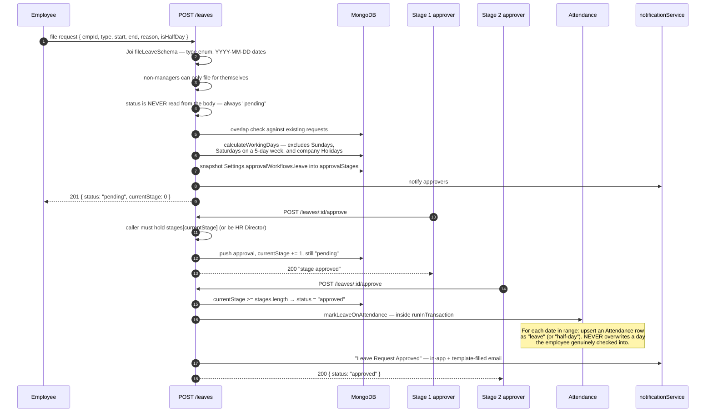

**Default stages** when `Settings.approvalWorkflows.leave` is unconfigured: `['HR Manager', 'HR Director']`. Because stages are **snapshotted onto the request at creation time**, editing the workflow later does not change requests already in flight.

**Decline** at any stage terminates the request immediately (`status: 'declined'`) and notifies the employee.

**Withdraw** (`POST /leaves/:id/withdraw`) is self-service, allowed only while `status === 'pending'`, by the owner or an HR admin.

`Expense` claims use the **same engine** — `approvalStages` / `currentStage` / `approvals`, defaulting to `['Finance Lead', 'HR Director']`.

---

## 📊 Dashboard Data Flow

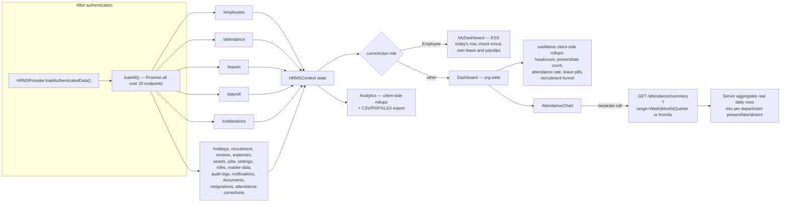

**Two different data paths, on purpose:** headline counters are computed client-side with `useMemo` from the already-loaded collections (cheap, instant), while the attendance chart calls a dedicated **server-side aggregation** endpoint (`GET /attendance/summary`) because it spans a date range far larger than the 100-row list cap.

**Scoping.** `GET /attendance`, `/leaves` and `/payroll` all narrow to `{ empId: req.auth.employeeId }` unless the caller is `HR Director`/`HR Manager` (payroll also allows `Finance Lead`), so an Employee's dashboard is populated by the same endpoints returning only their own rows.

---

## 🔌 API Architecture & Reference

**Base path:** `/api/v1` · **Auth:** `Authorization: Bearer <accessToken>` on everything except the routes marked public · **Interactive docs:** `GET /api-docs` (Swagger UI).

**Error envelope** — every handled error:

```json
{ "error": { "code": "MACHINE_READABLE_CODE", "message": "Human readable message." } }
```

**Pagination** — list endpoints are dual-mode. With no `page`/`limit` they return a **plain array capped at 100 rows** (legacy callers). With either present they return `{ rows, total, page, limit }`.

### Auth — `/api/v1/auth`

| Method | Path | Auth | Notes |
|---|---|---|---|
| POST | `/login` | public | Rate-limited 10/15 min. Returns `{ accessToken, user }` or `{ requiresTwoFactor: true, email }` |
| POST | `/face-login` | public | `multipart/form-data`: `email` + `photo`. Server re-verifies the face itself |
| POST | `/verify-2fa` | public | `{ email, otp }` — 6 digits, 10-minute TTL |
| POST | `/refresh` | cookie | Rotates the refresh token; revokes the old row |
| POST | `/logout` | cookie | Revokes the row and clears the cookie |
| GET | `/me` | ✅ | Current user |
| GET | `/sessions` | ✅ | Own live sessions |
| DELETE | `/sessions/:id` | ✅ | Revoke one |
| POST | `/sessions/revoke-others` | ✅ | Revoke all but the current |
| POST | `/change-password` | ✅ | `{ currentPassword, newPassword }` |
| POST | `/forgot-password` | public | Emails an OTP. **Same response whether or not the account exists** (no enumeration). HR Director is refused |
| POST | `/reset-password` | public | `{ email, otp, newPassword }` |

### Employees — `/api/v1/employees`

| Method | Path | Role | Notes |
|---|---|---|---|
| GET | `/` | ✅ any | Supports `page`, `limit` and filters |
| GET | `/:id` | ✅ any | |
| POST | `/` | HR Manager | Joi `createEmployeeSchema` |
| POST | `/bulk-update` | HR Manager | `{ ids[], patch }` — only restricted fields apply |
| PATCH | `/:id` | HR or self | Restricted fields stripped for self-service |
| POST | `/:id/verify-onboarding` | HR Manager | → `HR Verified` + `status: active` |
| DELETE | `/:id` | HR Manager | `?soft=true` → `status: terminated` instead of deletion |

### Attendance — `/api/v1/attendance`

| Method | Path | Role | Notes |
|---|---|---|---|
| GET | `/` | ✅ any | Non-managers see only their own rows; auto-creates today's row |
| GET | `/summary` | ✅ any | `range=Week\|Month\|Quarter` or `from`/`to` → per-department totals |
| GET | `/qr-token` | HR Manager | Single-use token, 12-second TTL |
| POST | `/qr-checkin` | ✅ any | `{ token, lat?, lng?, accuracy?, timestamp? }` |
| GET | `/:id` | ✅ any | |
| POST | `/` | HR Manager | Manual row creation |
| PATCH | `/:id` | HR Manager | Only `name`, `dept`, `status`, `checkIn`, `checkOut` |
| DELETE | `/:id` | HR Manager | |
| POST | `/:id/check-in` | ✅ owner or HR | `multipart/form-data` — `photo` + `lat`/`lng`/`accuracy`/`timestamp`/`deviceId` |
| POST | `/:id/check-out` | ✅ owner or HR | Same shape |

### Leave — `/api/v1/leaves`

| Method | Path | Role |
|---|---|---|
| GET | `/` · `/:id` | ✅ any (scoped) |
| POST | `/` | ✅ any (self) / HR for others |
| POST | `/:id/withdraw` | owner or HR, pending only |
| POST | `/:id/approve` · `/:id/decline` | stage-required role, or HR Director |
| PATCH | `/:id` · DELETE `/:id` | HR Manager |

### Everything else

| Router | Endpoints | Access highlights |
|---|---|---|
| `/users` | list, create, patch, delete, `/:id/sessions`, `/:id/resend-welcome` | **HR Director only** |
| `/roles` | list, create, patch, delete | Read: any; write: HR Director. The 4 default roles cannot be deleted |
| `/payroll` | CRUD | HR Manager + Finance Lead; employees see only their own |
| `/expenses` | CRUD + `/:id/approve` + `/:id/decline` | Stage-aware, same engine as leave |
| `/assets`, `/jobs`, `/holidays`, `/recruitment` | CRUD | HR Manager (assets also Finance Lead) |
| `/reviews` | CRUD + self-review | List/create/delete: HR Manager. **`PATCH /:id` is dual-path**: HR Manager/Director may edit any field; an employee may only patch their *own* review, and only `selfRating`, `selfComments`, `status` (`SELF_REVIEW_KEYS`) — any other field or any other employee's review is `403` |
| `/documents` | CRUD + `/:id/download` | Upload HR only; listing is visibility-filtered; download is per-record authorised |
| `/resignations` | list, create, `/:id/clearance`, `/:id/fnf`, `/:id/fnf/pay`, patch | FnF is Finance Lead/HR Director; **`/fnf/pay` is idempotent and rate-limited to 30/15 min** |
| `/attendance-corrections` | list, create, `/:id/approve`, `/:id/reject` | Approve/reject: HR Manager |
| `/celebrations` | list, patch | Computed live from `dob`/`joinDate`; PATCH records the wish |
| `/notifications` | list, `/:id/read`, `/read-all`, delete | Own + broadcast only |
| `/audit-logs` | list, create | **Read: HR Director only.** Supports `search`, `from`, `to` (regex is escaped) |
| `/master-data` | categories + values CRUD | Write: HR Director |
| `/settings` | get, patch, `/device-key/regenerate` | Patch: HR Manager. `biometricDeviceApiKey` is stripped from GET |
| `/files` | `/attendance/:id/:which` | Streams a check-in selfie to its owner or HR only |
| `/face` | `/enroll`, `/status/:userId`, `DELETE /:userId` | Self, or HR on behalf of another |
| `/device-punch` | POST | **No JWT** — `X-Device-Key` shared secret; mounted outside `/attendance` on purpose |
| `/device-mappings` | list, create, delete | HR Manager |
| `/health`, `/metrics` | GET | ⚠️ **Unauthenticated** |
| `/ai/predict`, `/ai/telemetry` | GET / POST | ⚠️ **Unauthenticated** — see Known Limitations |

> **OpenAPI coverage is partial.** Only 3 route files carry `@openapi` JSDoc blocks (`auth.js`, `employees.js`, `leave.js`), so Swagger UI renders a small subset of the surface above. `Smaatech-HRMS.postman_collection.json` at the repo root covers auth, employees, leaves, expenses and settings.

---

## 🔗 External Integrations

| Service | Purpose | Implementation | Status |
|---|---|---|---|
| **Brevo** (`api.brevo.com/v3/smtp/email`) | All transactional email — OTP, 2FA, welcome, notifications | Direct `fetch()` to the HTTPS API. **SMTP is deliberately not used** — Render's free tier blocks ports 25/465/587, so an SMTP connection can never leave the host | ✅ Production |
| **OpenStreetMap Nominatim** | Reverse-geocodes check-in coordinates into an address | `fetch()` with an identifying `User-Agent` and a 5-second `AbortController` timeout. Best-effort: a failure yields a `null` address and **never blocks a check-in** | ✅ Production |
| **MongoDB** | Primary datastore | Mongoose 8 | ✅ Production |
| **face-api.js / TensorFlow.js** | Face detection + 128-float descriptors | Browser (`face-api.js`) for UX; server (`@vladmandic/face-api` on the WASM backend) as the verification authority | ✅ Production |
| **S3 / Cloudflare R2 object storage** | Cloud photo + document storage | ⚠️ **Stub.** `savePhoto()` returns an `s3://bucket/ref` string **without uploading anything**, and `readPhoto()` returns `null` for such refs. No AWS SDK is installed | 🟡 Planned |
| **Redis** | — | Declared as a service and `REDIS_URL` in `docker-compose.yml`, but **no application code imports or connects to Redis** | ❌ Not implemented |
| **ZKTeco / eSSL biometric terminals** | Physical attendance devices | The **HTTP ingest endpoint is real and works** (`POST /api/v1/device-punch`). The vendor TCP protocol bridge (e.g. `node-zklib`) is not built. The Integrations UI labels its ping/sync as simulated demo mode in the page itself | 🟡 Partial |
| **Twilio / SendGrid gateway fields** | SMS / alternate email | `Settings` stores `gatewayTwilioSid`, `gatewayTwilioToken`, `gatewayTwilioFrom`, `gatewaySendgridKey`, `gatewaySmtp*` — **no code reads any of them** | ❌ Unused fields |
| **Tally (accounting)** | Payroll journal export | `client/src/lib/tally.js` generates Tally-compatible `VOUCHER`/`TALLYMESSAGE` XML client-side for hand-mapped import | 🟢 Basic |

---

## 📧 Email & Notification Workflow

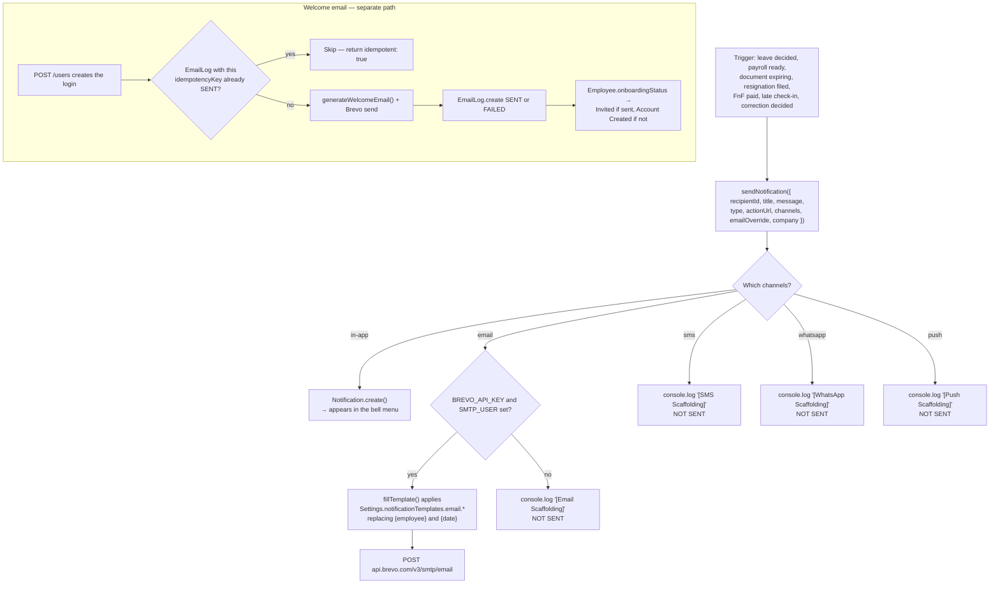

**Channel resolution.** `resolveChannels(settingsDoc, category)` reads `Settings.notifyChannels[category]` (`leave`, `payroll`, `birthday`, `attendance`), lowercases the display labels, and falls back to `['in-app']`.

**Templates.** `Settings.notificationTemplates` holds `email` / `sms` / `whatsapp` variants for `leaveApproval` and `payrollSlip`, in a `Subject: …\n\n Body…` format with `{employee}` and `{date}` placeholders. `fillTemplate()` returns `null` for an unconfigured template so callers fall back to their hardcoded title/message.

**Delivery audit.** `EmailLog` records `emailType` (`WELCOME`/`OTP`/`RESET`/`SYSTEM`), `status` (`SENT`/`FAILED`), `failureReason` and `idempotencyKey`. Its `retryCount` / `lastRetryAt` fields exist on the schema but **no retry worker writes them** — there is no automatic retry today.

**Never blocking.** Every notification call site is wrapped in `try/catch`; a notification failure never fails the business action that triggered it.

---

## 🙂 Face Authentication Workflow

Face recognition runs in **two places with very different authority**:

| | Browser (`client/src/lib/faceAuth.js`) | Server (`server/src/lib/faceEngine.js`) |
|---|---|---|
| Library | `face-api.js` 0.22 | `@vladmandic/face-api` on `tfjs` + WASM backend |
| Purpose | UX — decide *which account to attempt*, blink liveness prompt | **The verification authority** |
| Trusted? | ❌ No. A forged client can claim anything | ✅ Yes — it re-detects and re-matches the uploaded photo itself |

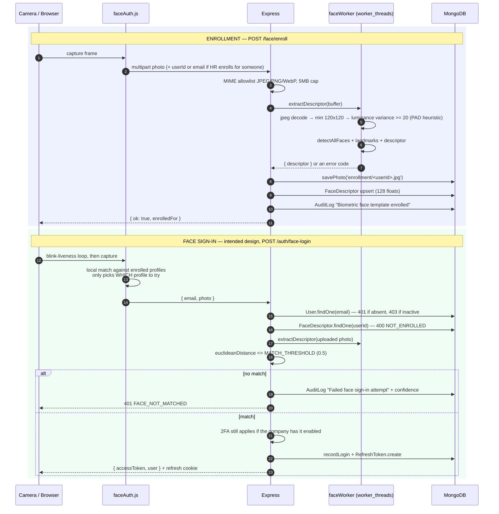

> ⚠️ **The "Sign in with face" button on the login screen is currently non-functional.** `FaceLogin.jsx` only matches against `profiles` filtered to those carrying a `faceDescriptor`. That array comes from `settings.loginProfiles` in `LoginScreen.jsx` — but no code anywhere (client or server) ever writes `loginProfiles`, and the `Settings` Mongoose schema has no such field, so `settings.loginProfiles` is always `undefined` and the picker always falls back to `DEFAULT_LOGIN_PROFILES`, none of which carry a `faceDescriptor` either. The result: `enrolledProfiles` is always empty and the modal immediately shows "No face profiles enrolled yet," regardless of how many users have actually enrolled a face server-side. **This is distinct from face-based attendance check-in, which works** — `FaceAttendanceModal.jsx` sends the captured photo straight to the server without a local pre-match step. See [Known Limitations](#-known-limitations).

**Threshold & confidence.** `MATCH_THRESHOLD = 0.5` Euclidean distance on 128-float descriptors. `confidenceFromDistance()` maps distance to a 0–100 number — the source explicitly notes this is a **distance heuristic, not a calibrated probability**, and should be labelled "match confidence", not "% certainty".

**Presentation-attack detection (PAD) — heuristic only.** Two cheap checks run before matching: a minimum 120×120 resolution gate, and a luminance-variance gate (`variance < 20` → `LOW_QUALITY`) that rejects flat/blank frames. The browser adds an eye-aspect-ratio **blink prompt**. None of this is a certified anti-spoofing model; a high-quality video replay is not reliably detected.

**Template revocation.** `DELETE /face/:userId` — by the user themselves or an HR admin — deletes the `FaceDescriptor` row and writes an audit entry.

**Error codes** (all mapped to human messages by `faceFailureMessage()`): `ENGINE_NOT_READY`, `NO_PHOTO`, `NOT_ENROLLED`, `NO_FACE`, `MULTIPLE_FACES`, `LOW_RESOLUTION`, `LOW_QUALITY`, `FACE_NOT_MATCHED`.

**Graceful degradation.** `initFaceEngine()` catches every failure and logs a warning rather than crashing the boot; if the models directory or WASM backend is unavailable, face routes return `ENGINE_NOT_READY` and the rest of the app keeps working.

---

## 📍 Device & Location Tracking

Everything persisted about a punch's origin is **derived server-side from the request itself** — never from a client-supplied label.

| Field | Source | Server-derived? |
|---|---|---|
| `checkInIp` / `checkOutIp` | First hop of `X-Forwarded-For`, else `req.ip` | ✅ |
| `checkInDevice` / `checkOutDevice` | `ua-parser-js` over the raw `User-Agent` header → `{ name, type, browser, os }` | ✅ |
| `checkInLoc` / `checkOutLoc` | `lat.toFixed(5), lng.toFixed(5)` from client coordinates | Client coords, server-formatted |
| `checkInAddress` / `checkOutAddress` | Nominatim reverse geocode of those coordinates | ✅ |
| `checkInAccuracy` | Browser Geolocation `coords.accuracy` | Client-reported, **validated** |
| `checkInDeviceId` | Browser `crypto.randomUUID()` persisted in `localStorage` | Client-reported |
| `checkInVerification` | `{ face: { matched, confidence, distance }, gps: { inside, distance }, verifiedAt }` | ✅ |
| `anomalyFlags` | `shared-device` when the same device punched another employee within 24 h | ✅ |

**Geofence enforcement** (`lib/geofence.js`), active only when `Settings.gpsCheckInEnabled`:

| Rejection | Trigger |
|---|---|
| `NO_COORDINATES` | `lat`/`lng` missing |
| `LOW_ACCURACY` | `accuracy > 100 m` |
| `STALE_FIX` | Fix older than 30 seconds |
| `OUTSIDE_GEOFENCE` | Haversine distance > `Settings.geofenceRadius` (default 25 m from 19.0760, 72.8777) |

The browser runs the *same* Haversine calculation for instant feedback, but only the server's verdict is enforced.

> **`deviceId` is a deterrent, not attestation.** It is a `localStorage` UUID — clearing site data or switching browsers resets it. Real device attestation would require a native app (Play Integrity / App Attest). The code says so explicitly.

---

## 📂 File & Document Handling

**Storage.** Files are written to `server/uploads/<subdir>/` — `attendance/<empId>/`, `enrollment/`, `documents/`. The directory is git-ignored. Only a relative `fileRef` string is stored in MongoDB.

**Path-traversal containment.** `resolveWithinUploads()` rejects any resolved path that is not exactly the uploads root or prefixed by root + separator. The source notes why a bare `startsWith(UPLOADS_ROOT)` was insufficient: it would wrongly accept a sibling `uploads-evil` directory.

**Upload limits.**

| Route | Field | Max | Allowed MIME |
|---|---|---|---|
| Attendance check-in/out, face enroll, face login | `photo` | 5 MB | `image/jpeg`, `image/png`, `image/webp` |
| Documents | `file` | 5 MB | PDF, JPEG, PNG, Word (.doc/.docx), Excel (.xls/.xlsx) |

All uploads use `multer.memoryStorage()` — nothing untrusted is written to disk before validation. `wrapUpload()` converts multer rejections into a clean `400 INVALID_FILE` instead of an opaque `500`.

**Mass-assignment protection.** `fileRef`, `company` and `reminderSent` are always server-computed; only `ALLOWED_DOCUMENT_FIELDS` (`title`, `owner`, `ownerId`, `folder`, `type`, `visibility`, `expiryDate`) are accepted from the body.

**Access control on read.**

- **Attendance selfies** (`GET /files/attendance/:attendanceId/:which`) — never served as static files. Only the employee themself or HR Manager/Director, checked per record. Response is `Cache-Control: private, max-age=3600`.
- **Documents** (`GET /documents/:id/download`) — HR Director and the owner always pass; otherwise `visibility: 'hr'` requires HR Manager and `visibility: 'finance'` requires Finance Lead. Served with `Content-Disposition: attachment` and a sanitised filename.

**Document expiry.** A nightly job finds documents with a non-empty `expiryDate` within 30 days and `reminderSent !== true`, batches the recipient lookup into one query, sends in-app + email reminders in non-blocking chunks of 50, and sets `reminderSent = true`.

---

## 🛡 Security Architecture

Only controls that exist in the code are listed.

### Authentication & credentials

| Control | Implementation |
|---|---|
| Password hashing | `bcryptjs`, cost 10, on registration, admin creation, welcome resend and reset |
| Password policy | ≥ 8 chars with a letter and a digit, enforced in Joi *and* `isStrongPassword()` |
| Access tokens | HS256 JWT, **15-minute** TTL, memory-only on the client |
| Refresh tokens | Opaque 48-byte random, **SHA-256 hashed at rest**, rotated on every use, individually revocable |
| Cookie hardening | `httpOnly`, `secure` + `sameSite=None` in production, scoped to `path=/api/v1/auth` |
| 2FA | Per-company toggle; 6-digit OTP, **bcrypt-hashed**, 10-minute TTL, delivered only by email |
| Separate OTP namespaces | `loginOtpHash` (2FA) and `otpHash` (password reset) are distinct fields, so a shoulder-surfed login code can't reset a password |
| Brute-force lockout | 5 failed attempts → 15-minute lock, shared across password, 2FA and reset-OTP failures |
| User enumeration | `/forgot-password` returns `{ ok: true }` whether or not the account exists |
| Response hygiene | `User.toJSON` deletes `passwordHash`, both OTP hashes/expiries, `failedLoginAttempts`, `lockedUntil` |
| Forced rotation | Admin-created logins get `mustChangePassword: true` |

### Authorization

- `requireAuth` verifies the JWT signature and expiry on every protected router.
- `requireRole()` checks a **database-backed** `Role.allowedActions` list, not just the JWT's role string — so revoking a capability takes effect without reissuing tokens.
- `companyFilter(req)` scopes **every** query by company, including for HR Director.
- Ownership checks are separate from role checks (self check-in, own leave withdrawal, own profile edit, own attendance photo).
- Mass-assignment allowlists on attendance (`ALLOWED_ATTENDANCE_FIELDS`), documents (`ALLOWED_DOCUMENT_FIELDS`) and employees (`RESTRICTED_FIELDS`).
- The 4 system roles cannot be deleted through `DELETE /roles/:id`.

### Transport & headers

| Control | Where |
|---|---|
| `helmet()` default headers | API (`contentSecurityPolicy: false` so Swagger UI renders) |
| **CSP** | Set by the static host on the client: `default-src 'self'; script-src 'self' 'wasm-unsafe-eval'; style-src 'self' 'unsafe-inline' fonts.googleapis.com; font-src 'self' fonts.gstatic.com; img-src 'self' data: blob: …; connect-src 'self' <API origin>; worker-src 'self'; object-src 'none'; base-uri 'self'; frame-ancestors 'none'` |
| CORS | Explicit allowlist: `localhost:5173`, `localhost:3000`, `CLIENT_ORIGIN`, **plus any `*.vercel.app` origin** (see Known Limitations). `credentials: true` |
| `frame-ancestors 'none'` | Clickjacking protection via CSP |

### Rate limiting

| Limiter | Scope | Budget |
|---|---|---|
| `apiLimiter` | all `/api/*` | 300 / 15 min |
| `authLimiter` | `/auth/login`, `/auth/verify-2fa`, `/auth/forgot-password`, `/auth/reset-password` | 15 / 15 min |
| `loginLimiter` | `/auth/login`, `/auth/face-login`, `/auth/verify-2fa`, `/auth/forgot-password`, `/auth/reset-password` | 10 / 15 min |
| `financialLimiter` | `/resignations/:id/fnf/pay` | 30 / 15 min |

`apiLimiter`, `authLimiter` and `financialLimiter` are fully **skipped** when `NODE_ENV=test`. `loginLimiter` is not skipped — instead its cap is raised from 10 to **1000** per 15 minutes in test mode, so integration tests don't trip it under normal load.

### Injection & input

- **NoSQL injection** — `express-mongo-sanitize` strips `$`/`.` keys; all queries go through Mongoose with typed schemas and `strictQuery: true`. There is no SQL and no raw query concatenation anywhere.
- **Input validation** — Joi schemas with `stripUnknown: true` and `abortEarly: false` on login, 2FA, forgot/reset/change password, employee create/patch, leave filing, expense filing and payroll creation.
- **ReDoS / regex injection** — the audit-log `search` parameter is escaped (`replace(/[.*+?^${}()|[\]\\]/g, '\\$&')`) before being used as a `RegExp`.
- **XSS** — React escapes interpolated content by default. `xlsx` is used **write-only**; the source documents that `XLSX.read()` is never called on user-supplied files, so the parser-side CVEs are unreachable.
- **CSRF** — the API is token-authenticated with a `Bearer` header, not cookie-authenticated, so a cross-site form post carries no credentials. The refresh cookie is `SameSite=None` and path-scoped to `/api/v1/auth`; `/auth/refresh` is the only route it reaches.

### Secrets management

- No secret has a hardcoded fallback in server code. `db.js` throws if `MONGODB_URI` is missing; `api/index.js` returns `MISSING_CONFIG` listing which of `MONGODB_URI` / `JWT_ACCESS_SECRET` / `JWT_REFRESH_SECRET` are unset.
- `.env`, `client/.env`, `server/.env`, `logs/` and `server/uploads/` are git-ignored; `.dockerignore` excludes `.env*` and `logs` from the image.
- `render.yaml` marks every secret `sync: false` (prompted, never committed).
- `Settings.biometricDeviceApiKey` is **generated server-side only** (`crypto.randomBytes(24)`), excluded from the `SERVER_OWNED_KEYS` patch allowlist so it can't be set to a weak value, **stripped from `GET /settings`**, and returned exactly once by `POST /settings/device-key/regenerate`.

### Audit logging

`logAudit()` writes an `AuditLog` on every mutating route with actor `{ id, name, role }`, action, subject, IP, user agent, and a computed field-level `diff`. `createdAt`, `updatedAt`, `__v`, `id`, `_id`, **`password` and `tokens`** are excluded from the diff. Security events specifically audited: sign-in, sign-out, blocked-because-locked, failed sign-in, failed 2FA, failed face sign-in, failed face verification during a punch, password reset requested/completed, session revoked by admin, biometric template enrolled/revoked, device key regenerated.

---

## ⏰ Background Jobs & Scheduling

Both schedulers start from `index.js` with a 5-second delay (to let the DB connect) and then a `node-cron` daily trigger at midnight. Both call `connectDB()` defensively first and process in non-blocking batches.

| Job | Schedule | Work |
|---|---|---|
| `startAttendanceDailyScheduler` | boot + `0 0 * * *` | **(a)** Create today's `Attendance` row for every employee — one query for existing rows, holidays batched per company, statuses pre-derived (`leave` / `holiday` / `absent`), then `bulkWrite` in unordered 250-item chunks. **(b)** Notify yesterday's unexplained absences (`status: absent`, `checkIn: null`) to the employee and their manager, in chunks of 50. |
| `startDocumentExpiryScheduler` | boot + `0 0 * * *` | Find documents expiring within 30 days with `reminderSent !== true`, resolve all owners in one query, send in-app + email reminders in chunks of 50, mark `reminderSent = true`. |

The unique `{ empId, date }` index makes the row-creation job safely re-runnable; duplicate-key errors (`code 11000`) are swallowed by design.

---

## 🚀 CI/CD Pipeline

`.github/workflows/ci.yml` — triggers on push and pull request to `main` / `master`.

```mermaid
flowchart LR
    T["push / PR to main or master"] --> CO["actions/checkout@v4"]
    CO --> NODE["actions/setup-node@v4<br/>Node 20.x, npm cache"]
    NODE --> INST["npm ci (root)<br/>npm --prefix server ci<br/>npm --prefix client ci"]
    INST --> LINT["npm --prefix client run lint<br/>ESLint"]
    LINT --> BUILD["npm --prefix client run build<br/>Vite production build"]
    BUILD --> ST["npm --prefix server run test<br/>Vitest + supertest + mongodb-memory-server"]
    ST --> CT["npm --prefix client run test<br/>Vitest + Testing Library"]
    CT --> DONE(["✅ Pipeline green"])

    style DONE fill:#e6ffed,stroke:#2a8
```

> ⚠️ **The workflow is named "CI/CD Pipeline" but contains no deployment job.** There is no deploy step, no registry push, no environment promotion. Deployment is handled by the hosting providers' own git integrations (Render blueprint / Vercel project), which are configured outside this repository. Treat the pipeline as **CI only**.

---

## ☁ Production Deployment Architecture

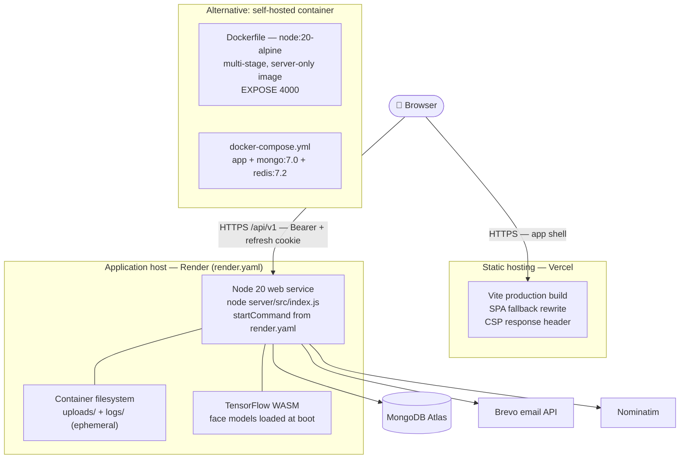

### Why the API is not serverless

The server loads face-api/TensorFlow WASM models at startup and keeps **in-process state**: the QR token store, the idempotency cache, and the settings cache. A serverless function that cold-starts per request would reload the models and lose that state.

### Deployment artefacts in this repository

| File | What it configures | Status |
|---|---|---|
| `render.yaml` | Render blueprint: `smaatech-hrms-api`, free plan, `npm --prefix server install`, `node server/src/index.js`, 6 prompted secrets | ✅ Active |
| `client/vercel.json` | Used when Vercel's Root Directory is `client`. SPA fallback + CSP header + an `/api/:path*` rewrite proxying to the Render origin | ✅ Active |
| `Dockerfile` | Multi-stage `node:20-alpine`; installs **server** production deps, copies `server/` + `public/`, exposes 4000, runs `npm run start`. **Does not build or serve the client** | 🟡 Server-only |
| `docker-compose.yml` | `app` + `mongo:7.0` (with healthcheck + named volume) + `redis:7.2`. ⚠️ Passes `MONGO_URI`, but the app reads **`MONGODB_URI`** — the DB connection will fail as written. Also ships a placeholder JWT secret and a Redis service nothing uses | 🟡 Needs fixing |
| `vercel.json` (root) + `api/index.js` | A serverless Express variant. **Not the documented deployment path** and materially divergent: no rate limiting, no compression, no Swagger, `cors({ origin: true })`, and missing the `face`, `device-punch`, `device-mappings`, `health` and `ai` routers | 🔴 Legacy/divergent |

---

## 🔧 Environment Configuration

Copy `server/.env.example` → `server/.env` and `client/.env.example` → `client/.env`. **Never commit a real `.env`.** All values below are placeholders.

### Server (`server/.env`)

| Variable | Required | Purpose |
|---|:---:|---|
| `MONGODB_URI` | ✅ | MongoDB connection string, including a database name. `db.js` throws without it |
| `PORT` | — | HTTP port (default `4000`; Render assigns it) |
| `JWT_ACCESS_SECRET` | ✅ | HS256 signing key for 15-minute access tokens |
| `JWT_REFRESH_SECRET` | ⚠️ | Checked by `api/index.js` but **never read by any code path** — refresh tokens are opaque, not JWTs |
| `CLIENT_ORIGIN` | ✅ prod | Frontend origin added to the CORS allowlist |
| `BREVO_API_KEY` | ✅ email | Brevo transactional API key. Without it, email silently degrades to console scaffolding (OTP/2FA routes return `502 EMAIL_FAILED`) |
| `SMTP_USER` | ✅ email | The **verified Brevo sender address** — used as the `from`, not for SMTP |
| `NODE_ENV` | — | `production` enables `secure`/`sameSite=None` cookies; `test` relaxes rate limits and bypasses the face worker |
| `LOG_LEVEL` | — | winston level (default `info`) |
| `ENABLE_CLUSTER` | — | `true` forks one worker per CPU |
| `WEB_CONCURRENCY` | — | Explicit worker count (also enables clustering) |
| `DISABLE_FACE_WORKER` | — | `true` runs face extraction in-process instead of a worker thread |
| `STORAGE_DRIVER` | — | `s3` switches `photoStorage` to cloud mode — ⚠️ currently a **stub that does not upload** |
| `S3_BUCKET` | — | Bucket name for the stub above |
| `VERCEL` | auto | Set by Vercel; disables the file log transport (read-only FS) |
| `SEED_ADMIN_PASS` / `SEED_HR_PASS` / `SEED_FINANCE_PASS` / `SEED_EMPLOYEE_PASS` | — | Demo seed passwords. ⚠️ `seed.js` has **hardcoded fallbacks** if unset — see Known Limitations |

### Client (`client/.env`)

| Variable | Required | Purpose |
|---|:---:|---|
| `VITE_API_BASE_URL` | prod only | e.g. `https://<your-api-host>/api/v1`. Unset locally — the Vite dev proxy forwards `/api` to `localhost:4000` |

### Generating secrets

```bash
node -e "console.log(require('crypto').randomBytes(48).toString('hex'))"
```

---

## 📁 Project Structure

```
Smaatech-hrms/
├── client/                        # React 18 + Vite SPA
│   ├── src/{pages,components,lib,context,data,test-utils}/
│   ├── vercel.json                # SPA fallback + CSP + API proxy
│   └── vite.config.js             # publicDir '../public', proxy, manual chunks, vitest config
├── server/                        # Express + Mongoose API
│   ├── src/{routes,models,lib,middleware,validations,test-utils}/
│   ├── scripts/                   # clean_db, face-spike, migrateMasterValuesCompanyScope
│   ├── uploads/                   # git-ignored: attendance, enrollment, documents
│   └── logs/                      # git-ignored: rotated winston logs
├── public/                        # SHARED between client and server
│   ├── models/                    # face-api weights (tiny_face_detector, landmark_68, recognition)
│   ├── sw.js, manifest.json, logo.jpg
├── api/index.js                   # Legacy Vercel serverless Express variant
├── .github/workflows/ci.yml       # CI pipeline
├── Dockerfile / docker-compose.yml / .dockerignore
├── render.yaml / vercel.json
├── scripts/generate_backend_spec_pdf.py
├── Smaatech-HRMS.postman_collection.json
└── package.json                   # Workspace orchestrator
```

### Root npm scripts

| Script | Runs |
|---|---|
| `npm run dev` | `concurrently` — client on 5173 + server on 4000 |
| `npm run dev:web` / `dev:server` | Either half alone |
| `npm start` | `node server/src/index.js` |
| `npm run build` | Client production build |
| `npm run lint` | ESLint over the client |
| `npm test` | Server suite then client suite |
| `npm run seed:server` | ⚠️ **Destructive** demo seed |

### Development-only scripts

`check_db.js`, `server/check_api.js`, `server/debug_live.js`, `server/find_render_url.js`, `server/ping_render_now.js`, `server/scan_render.js`, `server/test_*.js` are ad-hoc debugging scripts, not part of the application or the test suite.

---

## 🧪 Testing

**Runner:** Vitest 4 on both sides. **Server:** `supertest` against the importable `app.js`, with `mongodb-memory-server` providing a real in-memory MongoDB (`--maxWorkers=1` because they share one instance). **Client:** Testing Library + jsdom.

```bash
npm test                  # both suites
npm --prefix server test  # server only
npm --prefix client test  # client only
```

**Verified result of a full run in this repository:**

| Suite | Files | Tests | Result |
|---|---:|---:|---|
| Server | 18 | 99 | ✅ all passing |
| Client | 6 | 26 | ✅ all passing |
| **Total** | **24** | **125** | ✅ |

### Coverage by area

| Test file | Focus |
|---|---|
| `routes/auth.test.js` (11) | Login, lockout, 2FA, refresh rotation, password reset |
| `routes/leave.test.js` (9) | Multi-stage approval, attendance marking, withdrawal |
| `routes/resignations.test.js` (8) | Clearances, FnF calculation, idempotent payout, exit automation |
| `routes/payroll.test.js` (6) | Scoping, LOP computation, role gates |
| `routes/tenantIsolation.test.js` (5) | Cross-company data leakage |
| `routes/employees.test.js` (4) | CRUD, restricted fields, bulk update |
| `routes/face.test.js` (3) | Enrollment, status, revocation |
| `routes/health.test.js` (3) | Health + metrics + Prometheus format |
| `routes/uploadSecurity.test.js` (3) | MIME allowlist, size cap, traversal containment |
| `routes/attendance.test.js` (2), `users.test.js` (2), `aiPredictor.test.js` (2), `app.test.js` (1) | Punch paths, user admin, predictor, app boot |
| `lib/shifts.test.js` (16) | Late/early/half-day incl. overnight shifts |
| `lib/notificationService.test.js` (11) | Channel resolution, template filling |
| `lib/passwordPolicy.test.js` (6), `photoStorage.test.js` (4), `jobQueue.test.js` (3) | Policy, storage containment, batching |
| `client/lib/helpers.test.js` (15), `faceAuth.test.js` (4), `apiClient.test.js` (2) | Date/format helpers, face utils, interceptor retry |
| `client/components/*.test.jsx` (5) | EmployeeForm, LeaveForm, AuditLogsTab |

**Not covered:** end-to-end browser tests, load/performance tests, and a coverage threshold gate — none are configured.

---

## 📈 Logging, Monitoring & Health Checks

### Logging

`winston` with a timestamped, `splat`-enabled printf format:

- **Console** transport (colorised) — always on.
- **Daily rotating file** `logs/server-%DATE%.log` — gzipped archives, 20 MB max size, 14-day retention. **Skipped when `process.env.VERCEL` is set**, because Vercel's filesystem is read-only outside `/tmp` and the transport would crash the function at startup.

Level is `LOG_LEVEL` or `info`.

### Health & metrics

| Endpoint | Returns |
|---|---|
| `GET /api/v1/health` | `{ status, db, uptime, timestamp }`. **`200`** when `mongoose.connection.readyState === 1`, **`503 degraded`** otherwise — suitable as a load-balancer readiness probe |
| `GET /api/v1/metrics` | JSON: `pid`, `uptime`, `eventLoopLagMs`, CPU cores + 1/5/15-minute load, RSS/heap/external memory, system memory ratio, DB state |
| `GET /api/v1/metrics?format=prometheus` | `text/plain; version=0.0.4` exposition of `process_uptime_seconds`, `process_heap_used_bytes`, `process_event_loop_lag_milliseconds`, `system_cpu_load_1m`, `mongodb_connection_status` |

An event-loop lag estimator runs on a 1-second `setInterval` (`.unref()`-ed so it never holds the process open).

### Predictive monitoring — `/api/v1/ai/*`

`lib/aiPredictor.js` keeps a rolling 100-sample telemetry window and returns a traffic forecast, an anomaly verdict and a scaling recommendation.

**What it actually is:** mean/standard-deviation **Z-score** thresholds (`> 2.5` on RPS or event-loop lag, `> 5%` error rate) plus a hardcoded 08:00–10:00 "morning punch rush" multiplier (2.8×, otherwise 1.2×). `confidenceScore` values are constants (0.95 / 0.91 / 0.88) and `aiModelStatus: 'ONLINE'` is a literal. **There is no trained model, no ML library, and no persistence** — it is a statistical heuristic. It is also **unauthenticated** and nothing in the UI consumes it.

### Alerting

⚠️ **No alerting is implemented.** There is no PagerDuty/Slack/webhook integration and no threshold-triggered notification. The `/metrics` Prometheus endpoint is the hook an external Prometheus + Alertmanager stack would scrape, but that stack is not part of this repository.

---

## 🚨 Error Handling

### Server

- `express-async-errors` lets `async` handlers throw straight into Express's error pipeline without explicit `try/catch` + `next(err)`.
- A terminal error middleware logs the full error via winston and returns a **generic** `500 INTERNAL_ERROR` — internal messages and stack traces are never leaked to the client. (`api/index.js`, the legacy serverless variant, *does* echo `err.message` — one more reason it is not the recommended path.)
- `index.js` installs `process.on('unhandledRejection')` and `process.on('uncaughtException')` handlers that log rather than exit.
- Non-fatal subsystems degrade instead of failing the request: DB connect retries once with a longer timeout; `initFaceEngine()` catches and warns; both cron schedulers are wrapped in `try/catch` at startup; every `sendNotification`/`logAudit` call site is wrapped; `reverseGeocode` returns `null` on failure.
- Duplicate-key errors (`11000`) are translated into meaningful `409` responses (`EMAIL_IN_USE`) or silently ignored where the index is being used deliberately for idempotency.

### Common error codes

| Code | HTTP | Meaning |
|---|---|---|
| `NO_TOKEN` / `INVALID_TOKEN` | 401 | Missing or expired access token |
| `INVALID_CREDENTIALS` | 401 | Wrong email or password |
| `ACCOUNT_LOCKED` | 423 | 5 failed attempts — locked for 15 minutes |
| `ACCOUNT_DISABLED` | 403 | `User.active === false` |
| `INVALID_OTP` | 400 | Wrong or expired OTP |
| `FORBIDDEN` | 403 | Role/ownership check failed |
| `VALIDATION_ERROR` | 400 | Joi rejection (all messages joined) |
| `TOO_MANY_REQUESTS` / `TOO_MANY_ATTEMPTS` | 429 | Rate limit |
| `INVALID_FILE` | 400 | MIME or size rejection |
| `NOT_ENROLLED` / `NO_FACE` / `MULTIPLE_FACES` / `LOW_QUALITY` / `LOW_RESOLUTION` / `FACE_NOT_MATCHED` | 400 | Face verification |
| `NO_COORDINATES` / `LOW_ACCURACY` / `STALE_FIX` / `OUTSIDE_GEOFENCE` | 400 | Geofence |
| `ALREADY_CHECKED_IN` / `NOT_CHECKED_IN` / `ALREADY_CHECKED_OUT` | 400 | Punch state |
| `INVALID_QR_TOKEN` | 400 | Expired or already-consumed QR token |
| `DEVICE_USER_UNMAPPED` | 404 | Biometric device user not linked |
| `EMAIL_FAILED` | 502 | Brevo send failed |
| `INTERNAL_ERROR` | 500 | Unhandled |

### Client

- A top-level `<ErrorBoundary>` wraps the whole tree in `main.jsx`.
- `ApiError` normalises every failure into `{ status, code, message }`; pages surface `err.message` through toasts.
- `loadAuthenticatedData()` clears its loading gate in a `finally` block so a flaky request can never leave the app stuck on "Loading workspace…".
- Non-critical collections in `loadAll()` use `.catch(() => [])` so one failing endpoint doesn't blank the dashboard.

---

## 📊 Implementation Status

Legend: 🟢 **Production** · 🟡 **Partial** · 🔵 **Basic** · ⚪ **Planned** · 🔴 **Missing / Unused**

| Module | Status | What is actually there |
|---|:---:|---|
| Authentication (password, JWT, refresh rotation, lockout) | 🟢 | Fully implemented and covered by 11 tests |
| Two-factor authentication (email OTP) | 🟢 | Real bcrypt-hashed OTP over Brevo; per-company toggle |
| Face authentication — enrollment & attendance punch | 🟢 | Server-side verification is authoritative; PAD is heuristic only |
| Face authentication — login screen button | 🔴 | `POST /auth/face-login` itself works, but the login screen's local profile picker never finds a match — see [Known Limitations #1](#-known-limitations) |
| RBAC / roles | 🟢 | DB-backed `allowedActions`; `Role` is **global, not per-company** |
| Employee management + onboarding lifecycle | 🟢 | CRUD, bulk, soft-delete, 8-stage lifecycle, field allowlists |
| Attendance — self-service (face + geofence) | 🟢 | Full server-side re-derivation |
| Attendance — QR check-in | 🟢 | Server-issued single-use 12s tokens |
| Attendance — corrections workflow | 🟢 | Request → approve → attendance upsert |
| Attendance — nightly row creation + absence alerts | 🟢 | Batched, idempotent |
| Attendance — biometric device ingest | 🟡 | HTTP endpoint + key auth + mapping are real; **vendor TCP bridge not built**; Integrations UI is self-labelled demo/simulated |
| Leave management | 🟢 | Multi-stage, overlap check, holiday-aware working days, attendance sync |
| Expenses | 🟢 | Same approval engine |
| Payroll | 🟡 | CRUD, components, LOP auto-computed from attendance. **PF/ESI/PT/TDS amounts are entered manually — nothing is computed from statutory rates** |
| Resignation / clearance / FnF | 🟢 | Transactional payout + exit automation + idempotency |
| Documents + expiry alerts | 🟢 | Upload allowlist, visibility scoping, authenticated download, nightly reminders |
| Assets / Jobs / Recruitment / Reviews / Holidays | 🟢 | CRUD with status workflows |
| Celebrations | 🟢 | Computed live; idempotent wishes |
| Dashboard & Analytics | 🟢 | Client rollups + server-side attendance aggregation + CSV/PDF/XLSX export |
| Notifications — in-app | 🟢 | Persisted collection, read/read-all/delete |
| Notifications — email | 🟢 | Brevo + configurable templates |
| Notifications — SMS / WhatsApp / Push | 🔴 | `console.log` scaffolding only — **nothing is sent** |
| Audit logging | 🟢 | Every mutating route, with field-level diffs |
| Health checks | 🟢 | Liveness + DB readiness, correct 503 semantics |
| Metrics (JSON + Prometheus) | 🔵 | Working, but **unauthenticated** and not scraped by anything in-repo |
| Alerting | 🔴 | Not implemented |
| Predictive monitoring (`/ai/*`) | 🔵 | Z-score heuristic, not ML; unauthenticated; no UI consumer |
| Multi-tenancy | 🟡 | Company scoping is thorough, but `Role` is global and `tenantPlugin` is unattached |
| Cluster mode | 🟡 | Works, but in-memory QR/idempotency/settings state is **per-process** (see Limitations) |
| Cloud object storage (S3/R2) | ⚪ | Stub — returns an `s3://` ref without uploading; no SDK installed |
| Redis | 🔴 | In `docker-compose.yml` only; no code uses it |
| Email retry queue | 🔴 | `EmailLog.retryCount` / `lastRetryAt` exist but are never written |
| OpenAPI / Swagger docs | 🟡 | UI is live at `/api-docs`, but only 3 of 27 route files are annotated |
| PWA / offline shell | 🔵 | Hand-rolled service worker, production-only, app-shell cache |
| Tally accounting export | 🔵 | Client-side XML generation for manual import |
| CI | 🟢 | Lint + build + both test suites on every push/PR |
| CD | 🔴 | **No deploy job** despite the workflow's name |
| Docker | 🟡 | Server-only image; compose has a wrong env var name and an unused Redis service |
| Vercel serverless API (`api/index.js`) | 🔴 | Legacy and divergent — not the documented path |

---

## 🚧 Known Limitations

These are real findings from the current source, ordered roughly by impact.

1. **The "Sign in with face" button on the login screen does not work.** `FaceLogin.jsx` matches the camera capture only against profiles carrying a `faceDescriptor`. That list comes from `settings.loginProfiles` (`LoginScreen.jsx`), but the `Settings` Mongoose schema has no `loginProfiles` field and no code anywhere writes one — so it is always `undefined`, and the UI falls back to `DEFAULT_LOGIN_PROFILES`, whose entries never carry a `faceDescriptor` either. `enrolledProfiles` is therefore always empty, and the modal immediately shows "No face profiles enrolled yet," no matter how many users have actually enrolled a face. **Face-based attendance check-in and `POST /auth/face-login` itself both work** — this only breaks the login screen's local "which profile is this" picker. Fixing it means wiring the modal to a real enrolled-users lookup (e.g. `GET /face/status/:userId` per candidate, or a dedicated endpoint) instead of the unused `loginProfiles` field.

2. **`docker-compose.yml` sets `MONGO_URI`, but the app reads `MONGODB_URI`.** As written, `docker compose up` starts a container that cannot connect to its database. It also ships a placeholder `JWT_ACCESS_SECRET=production-jwt-secret-change-me`, omits `CLIENT_ORIGIN` and `BREVO_API_KEY`, and runs a Redis service nothing uses.

3. **CORS accepts any `*.vercel.app` origin.** `app.js` allows any origin matching `/\.vercel\.app$/` with `credentials: true`. Any Vercel-hosted page could make credentialed cross-origin requests. Narrow this to the exact deployment origin(s) in production.

4. **`/health`, `/metrics` and `/ai/*` are unauthenticated.** `/metrics` exposes process ID, memory, CPU load and DB state; `POST /ai/telemetry` accepts unauthenticated writes into the in-memory telemetry window. These should be bound to an internal network or protected.

5. **Cluster mode breaks in-memory state.** `qrTokenStore`, the idempotency store and `cacheStore` are per-process `Map`s. `qrTokenStore.js`'s own comment still assumes a single process — which was true before `cluster.js` was added. With `ENABLE_CLUSTER=true` and more than one worker, a QR token issued by worker A cannot be consumed by worker B, and an idempotency key is not shared. **Keep cluster mode off until this state moves to Redis or the database.**

6. **Seed passwords have hardcoded fallbacks.** `server/src/seed.js` falls back to a set of documented default values (see `server/.env.example`) when the `SEED_*_PASS` variables are unset, and prints them to stdout. The same defaults are also hardcoded in `client/src/lib/permissions.js`'s `DEFAULT_LOGIN_PROFILES` and ship in the client bundle — dead weight, since (per #1 above) the `password` field on those objects is never read by any code path. **Always set `SEED_*_PASS` to your own values, delete or deactivate the demo accounts after setup (Settings → Users & role access), and strip the `password` keys from `DEFAULT_LOGIN_PROFILES`.** If a production database was ever seeded without custom `SEED_*_PASS` values, treat the default accounts as compromised and rotate/delete them immediately.

7. **`npm run seed:server` is destructive.** It wipes and recreates `Employee`, `User`, `Attendance`, `Settings` and `Role`. Never run it against a database with real data.

8. **Uploads and logs are on ephemeral container storage.** On Render (and in the Docker image) `server/uploads/` and `logs/` are lost on every redeploy or restart — taking attendance selfies, enrollment photos and uploaded documents with them. The S3 adapter that would fix this is a stub (see #9).

9. **The cloud storage adapter does not upload.** With `STORAGE_DRIVER=s3`, `savePhoto()` logs and returns an `s3://…` reference **without writing the bytes anywhere**, and `readPhoto()` returns `null` for those refs. Enabling it silently loses every file.

10. **`Role` has no `company` field.** Roles are global across tenants, so a second company cannot have its own role definitions and `GET /roles` returns every role to every authenticated caller.

11. **`seed.js` creates `Settings` with `_id: 'singleton'`**, while `getSettingsDoc()` looks up settings by **company name** (`'Smaatech'`). The seeded document is therefore orphaned; a fresh default is created on first access.

12. **Face PAD is heuristic, not certified.** A luminance-variance check plus a browser blink prompt will not reliably stop a high-quality video replay or a mask. `deviceId` is a `localStorage` UUID, not hardware attestation.

13. **No automatic email retry.** A failed send is recorded in `EmailLog` with `status: 'FAILED'` and then left alone; `retryCount`/`lastRetryAt` are never written. Recovery is manual (`POST /users/:id/resend-welcome`).

14. **Notification channel gaps.** Selecting SMS, WhatsApp or Push in Settings produces a console log and nothing else — the UI offers channels that do not deliver.

15. **Statutory payroll is not computed.** PF, ESI, PT and TDS have categories and identity fields (PAN/UAN/ESI number/tax regime/state) but no rate engine; amounts are entered by hand.

16. **Partial API documentation.** 24 of 27 route files have no OpenAPI annotations, so `/api-docs` under-represents the real surface. The Swagger `servers` list is hardcoded to `http://localhost:4000`.

17. **`api/index.js` has drifted from `app.js`.** It lacks rate limiting, compression and Swagger, uses `cors({ origin: true })`, echoes raw error messages, and omits 5 of the 27 routers entirely — `ai`, `device-punch`, `device-mappings`, `face` and `health`/`metrics` are unreachable through it. Using it would silently disable several protections documented above.

18. **No `LICENSE` file** and no `license` field in any `package.json`.

19. **Holiday dates are year-agnostic display strings** (e.g. `"7 Jun, Sun"`), parsed by regex. They recur annually by design, but the format is fragile and not a real date type.

20. **No E2E or load tests**, and no coverage threshold enforced in CI.

---

## 🔭 Future Improvements

Ordered to match the limitations above.

1. Wire `FaceLogin.jsx` to a real enrolled-users source (e.g. a dedicated "list users with a face template" endpoint) instead of the never-populated `settings.loginProfiles`, so the login screen's face button actually finds a profile to match.
2. Fix `docker-compose.yml` (`MONGODB_URI`, real secrets via an env file, drop Redis until it is used).
3. Replace the `*.vercel.app` CORS wildcard with an exact allowlist.
4. Put `/metrics` and `/ai/*` behind authentication or an internal-network bind.
5. Move QR tokens, idempotency records and the settings cache to Redis (already provisioned in compose) so cluster mode is safe — then enable it.
6. Finish the S3/R2 adapter with a real SDK, and migrate uploads off ephemeral disk.
7. Remove the `password` field from `DEFAULT_LOGIN_PROFILES` and the seed fallbacks; make `SEED_*_PASS` mandatory.
8. Add `company` to `Role` and scope role queries per tenant; attach `tenantPlugin` to the schemas.
9. Build an email retry worker that actually uses `EmailLog.retryCount` / `lastRetryAt`.
10. Implement real SMS/WhatsApp/Push providers, or hide those channels in Settings until they exist.
11. Add a statutory rate engine for PF/ESI/PT/TDS with per-state PT slabs.
12. Annotate all 27 routers with OpenAPI JSDoc and make the Swagger `servers` list environment-driven.
13. Either bring `api/index.js` back in sync with `app.js` or delete it along with the root `vercel.json`.
14. Replace the Z-score predictor with either a real model or an honest "heuristic capacity hints" label.
15. Add a `LICENSE`, E2E tests (Playwright), a coverage gate, and a real deploy job to the CI workflow.
16. Store `Holiday.date` as a proper `YYYY-MM-DD` value with an explicit `recurring` flag.

---

## 💻 Local Development Setup

### Prerequisites

- **Node.js 20+** (CI pins 20.x; the Docker image is `node:20-alpine`)
- **MongoDB** — Atlas or local. Transactions need a replica set; `runInTransaction()` degrades gracefully on standalone
- A **Brevo** account (free tier) if you want real OTP/2FA/welcome emails

### Install

```bash
git clone <repository-url>
cd Smaatech-hrms

npm install                  # root orchestrator (concurrently + serverless deps)
npm --prefix client install
npm --prefix server install
```

### Configure

```bash
cp server/.env.example server/.env
cp client/.env.example client/.env   # optional locally — the dev proxy handles /api
```

Fill in `MONGODB_URI`, `JWT_ACCESS_SECRET`, `JWT_REFRESH_SECRET`, and (for email) `BREVO_API_KEY` + `SMTP_USER`. Set your own `SEED_*_PASS` values.

### Seed & run

```bash
npm run seed:server   # ⚠️ DESTRUCTIVE — wipes Employee/User/Attendance/Settings/Role
npm run dev           # client → http://localhost:5173 · server → http://localhost:4000
```

The Vite dev server proxies `/api/*` to `localhost:4000`, so no CORS setup is needed locally.

**Useful URLs:** app `http://localhost:5173` · API `http://localhost:4000/api/v1` · Swagger `http://localhost:4000/api-docs` · health `http://localhost:4000/api/v1/health`

### Create a real login and remove the demo accounts

1. Sign in with the seeded HR Director account.
2. **Settings → Users & role access → Add user** — your own name, a real email, a strong password, role `HR Director`.
3. Sign out, sign back in as the new account to confirm it works.
4. Return to **Settings → Users & role access** and deactivate or delete all four seed accounts.

### Docker (server only)

```bash
docker build -t smaatech-hrms-api .
docker run -p 4000:4000 --env-file server/.env smaatech-hrms-api
```

> `docker compose up` will start, but see [Known Limitations #1](#-known-limitations) — fix `MONGO_URI` → `MONGODB_URI` in `docker-compose.yml` first.

---

## 🌐 Production Deployment

The deployment this repository is configured for is **static client on Vercel + persistent API on Render + MongoDB Atlas**.

### 1. API → Render

1. **New → Blueprint**, point Render at this repository. It reads `render.yaml` and proposes the `smaatech-hrms-api` web service.
2. Fill in the prompted secrets: `MONGODB_URI`, `JWT_ACCESS_SECRET`, `JWT_REFRESH_SECRET`, `BREVO_API_KEY`, `SMTP_USER`. Leave `CLIENT_ORIGIN` for step 3.
3. Deploy and note the resulting URL.
4. **MongoDB Atlas → Network Access → Allow access from anywhere (`0.0.0.0/0`)** — Render's free tier has no static egress IP.

### 2. Client → Vercel

1. **Add New → Project**, import the same repository.
2. Set **Root Directory** to `client`. Vercel auto-detects Vite; `client/vercel.json` supplies the SPA fallback and the CSP header.
3. Add `VITE_API_BASE_URL` = `https://<your-render-url>/api/v1`.
4. Deploy and note the resulting URL.

> ⚠️ `client/vercel.json` currently **hardcodes an API origin** in both its `/api/:path*` rewrite and its CSP `connect-src`. Update both to your own API host, or the deployed app will talk to the wrong backend.

### 3. Connect them

1. In Render, set `CLIENT_ORIGIN` to your Vercel URL and let the service restart.
2. Open the Vercel URL and sign in.

### Production checklist

- [ ] `NODE_ENV=production` (enables `secure` + `SameSite=None` cookies)
- [ ] Strong, unique `JWT_ACCESS_SECRET`
- [ ] `CLIENT_ORIGIN` set; `*.vercel.app` CORS wildcard narrowed
- [ ] API origin in `client/vercel.json` updated (rewrite **and** CSP `connect-src`)
- [ ] `BREVO_API_KEY` + a **verified** `SMTP_USER` sender
- [ ] All four seed accounts deleted or deactivated
- [ ] Atlas network access and a backup policy configured
- [ ] `ENABLE_CLUSTER` left **off** (see Limitations #4)
- [ ] A durable file store in place before relying on uploads (see Limitations #7–8)
- [ ] `/health` wired to the platform's health check; `/metrics` protected

> **Render free tier spins down after ~15 minutes idle.** The first request after that takes 30–60 seconds while the service wakes and reloads the TensorFlow models. That is cold start, not a bug.

---

## 🔧 Troubleshooting

| Symptom | Cause | Fix |
|---|---|---|
| `MONGODB_URI is not set` at boot | Missing env var | Set it in `server/.env` or the host dashboard. In Docker Compose, note it is misnamed `MONGO_URI` |
| Login hangs 30–60 s on first load | Render free-tier cold start | Expected. Upgrade the plan or keep the service warm |
| `Network Error` in the browser with a healthy server | CORS rejected the origin, or a rate limit ended the response | Check `CLIENT_ORIGIN`; note CORS is registered *before* the limiters so a real 429 is readable |
| `502 EMAIL_FAILED` on login or password reset | `BREVO_API_KEY` / `SMTP_USER` missing, or the sender is unverified | Verify the sender address in Brevo and set both variables |
| Emails silently not arriving, no error | Brevo not configured — `notificationService` falls back to console scaffolding | Set both variables; check the server log for `[Email Scaffolding]` |
| `ENGINE_NOT_READY` from face routes | `public/models/` missing, or the WASM backend failed to load | Confirm `public/models/` exists; check the `[face] init deferred` warning; try `DISABLE_FACE_WORKER=true` |
| `NOT_ENROLLED` on check-in | No `FaceDescriptor` for that user | Enroll a face first (ESS dashboard, or Settings → Users for HR) |
| `LOW_QUALITY` / `LOW_RESOLUTION` on every capture | PAD gates: below 120×120, or luminance variance < 20 | Improve lighting; face the camera directly |
| `OUTSIDE_GEOFENCE` / `LOW_ACCURACY` | Geofence enabled and the fix is poor or far | Check `geofenceLat/Lng/Radius` in Settings; accuracy must be ≤ 100 m and the fix ≤ 30 s old |
| `INVALID_QR_TOKEN` immediately | 12-second single-use TTL, or clustering split the store | Rescan. Disable cluster mode (Limitations #4) |
| `423 ACCOUNT_LOCKED` | 5 failed password/2FA/reset attempts | Wait 15 minutes, or clear `lockedUntil` in the database |
| `403 FORBIDDEN` for a role that should pass | `Role.allowedActions` is missing the mapped action | Check the `Role` document; re-seed or edit under Settings → Roles |
| Photos/documents vanish after a redeploy | Ephemeral container storage | See Limitations #7 — a durable store is required |
| Multipart upload fails with a boundary error | A manual `Content-Type` was set on `FormData` | `apiClient.js` already strips it; don't re-add it |
| Stale UI in dev after testing a prod build | A leftover service worker | `main.jsx` self-heals by unregistering and reloading once |
| Server tests are slow on first run | `mongodb-memory-server` downloading a MongoDB binary | One-time; it is cached afterwards |

---

## 🤝 Contributing & License

### Workflow

1. Branch from `main`.
2. Make the change; keep server and client mirrors in sync where they are deliberately duplicated (`lib/shifts.js`, `lib/permissions.js` ↔ `VALID_ROLES`, holiday parsing).
3. Run the full gate locally — the same four steps CI runs:
   ```bash
   npm --prefix client run lint
   npm --prefix client run build
   npm --prefix server test
   npm --prefix client test
   ```
4. Open a pull request against `main`. CI must be green.

### Conventions observed in this codebase

- **Commits** follow Conventional Commits (`feat:`, `fix:`, `refactor:`, with optional scopes).
- **Comments explain *why*, not *what*** — most non-obvious decisions in this repo carry a comment recording the failure mode they prevent. Please keep that up.
- **The server is always the authority.** Client-side validation, permission maps and face matching are UX; never move an enforcement decision to the client.
- **Every mutating route calls `logAudit()`.**
- **Every tenant-scoped query goes through `companyFilter(req)`.**
- **New request bodies get a Joi schema**, and new writable fields go on an explicit allowlist.

### License

**No license file is present in this repository** and no `package.json` declares a `license` field. Until one is added, treat this as proprietary software owned by Smaatech Engineering — all rights reserved.
